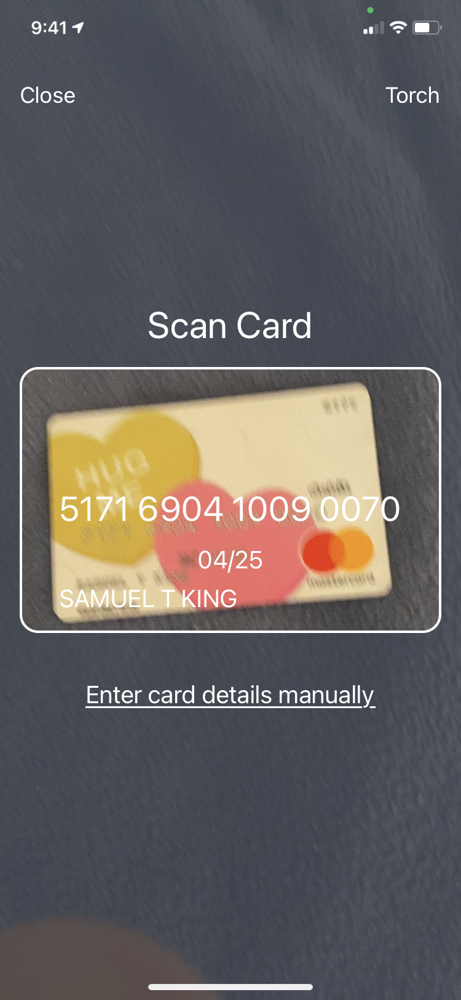
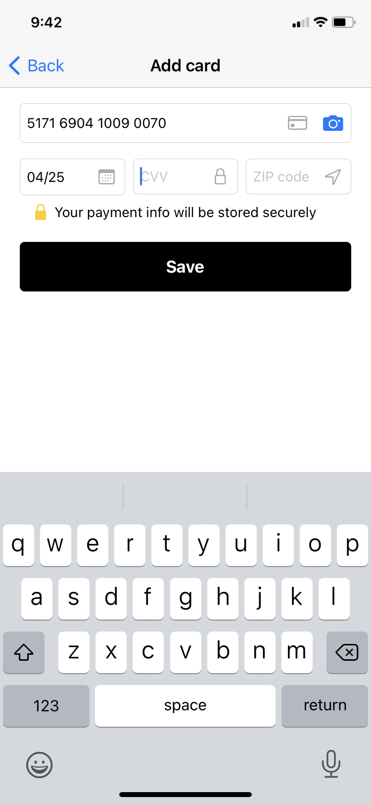

# iOS integration guide

## Installing the CardVerify module

Please follow the [general instructions](../bouncer-scan/verifying-high-risk-cards/ios-integration-guide/) for installing, setting up permissions, and configuring CardVerify.

## Using Zero Fraud

To use Zero Fraud, you invoke the `VerifyAddCardViewController` and register as a `VerifyAddCardResult` delegate to get notified when either the user cancels the card add process or when they are done and ready to save the new card.

```swift
import CardVerify
import UIKit

class PaymentMethodViewController: UIViewController, VerifyCardAddResult {
    
    override func viewDidLoad() {
        super.viewDidLoad()
    }
    
    @IBAction func addCardPress() {
        // invoke the VerifyCardAdd flow and register for notifications
        // when it is complete or the user cancels
        let vc = VerifyCardAddViewController(userId: userId)
        vc.cardAddDelegate = self
        navigationController?.pushViewController(vc, animated: true)
    }
    
    // -MARK: VerifyCardAddResults protocol implementation
    func userDidCancel(_ viewController: VerifyCardAddViewController) {
        // The user decided to not add a card
        navigationController?.popViewController(animated: true)
    }
    
    func userDidPressSave(creditCard: CreditCard) {
        // the user finished entering their card details and all of the
        // details are stored in the `creditCard` object.
        navigationController?.popViewController(animated: true)
        
        // Tokenize the card
    }
}
```

## Generating a Card Authentication Payload

For each transaction, to authenticate the payment method that you plan to use, you must generate a "card authentication payload" from the Bouncer SDK, pass this to your server, and then make a server-to-server call to Bouncer to get the authentication result.

**Note:** If the authentication result shows a failure to authenticate the card, you should put the user through a forced scan flow using [Card Verify]() or pass the authentication result into your own decision engine to make a more refined decision.

```swift
Bouncer.generateCardAuthenticationPayload() { (payload: String?) in
    // use this payload to send to the server to authenticate the payment method
}
```

## Customizing the UI

Zero Fraud supports full UI customization via subclassing our base classes and overriding our programmatic UI. Here is what the default scan and card detail entry views look like:





