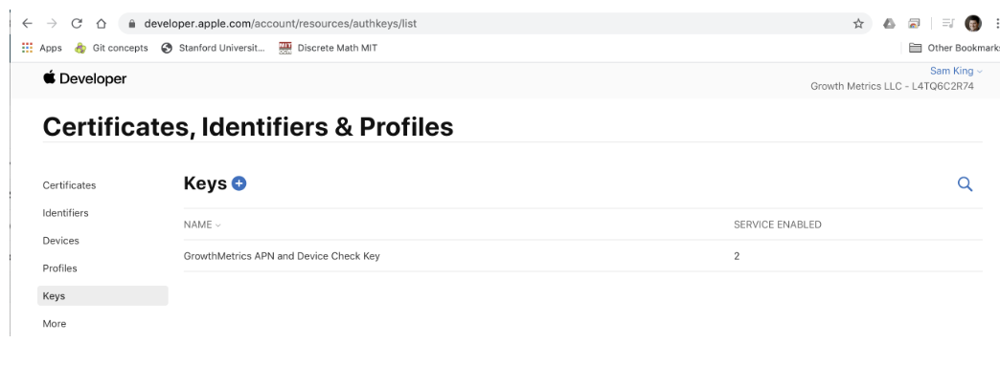
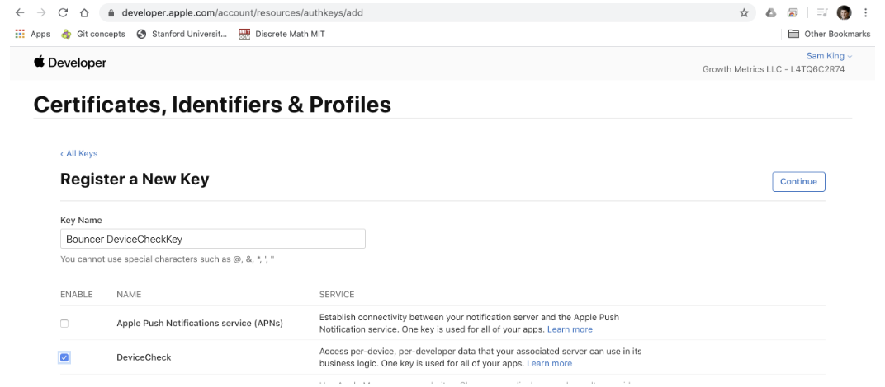
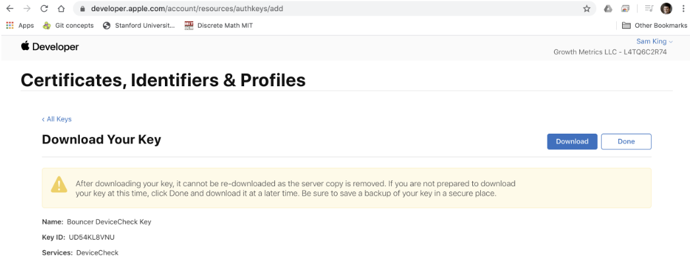

# Secure counting for iOS

As part of your integration with Bouncer, you can use our "secure counting" abstraction. Secure counting is an abstraction on top of DeviceCheck that enables us to count events, like cards added, on a per device basis. Because it's using DeviceCheck, it respects end-user privacy while using the hardware bits in DeviceCheck to maintain monotonically increasing counts. These counts remain robust even across device resets, making it a useful signal for detecting financial fraud.

For more information on how to access counts server side, see our [REST API](secure\_counting\_rest.md) documentation.

## iOS APIs for incrementing counts

After integrating [Card Verify](broken-reference) into your app, you can access high level APIs to increment counts at key parts in your app.

We include a pre-defined API for incrementing cards added to a device that your app should invoke after a user successfully adds a card:

```swift
FraudCheckApi.cardTokenized(userId: "kingst")
```

And we also support arbitrary events, such as successful logins that you can track simultaneously:

```swift
FraudCheckApi.incrementWithoutCompletion(event: "login_success", userId: "kingst")
```

## Provisioning a DeviceCheck key

To enable the secure counting abstraction, you provide Bouncer with a DeviceCheck key, that our server uses to communicate with Apple’s DeviceCheck server on behalf of your app. Providing Bouncer with a DeviceCheck key is safe because (1) you can scope it to only DeviceCheck, (2) Apple ensures that only one DeviceCheck key exists at any given time, and (3) you can revoke it whenever needed.

This document shows from a high level how to access the DeviceCheck key setting in Apple’s developer website. [https://developer.apple.com/account/resources/authkeys/list](https://developer.apple.com/account/resources/authkeys/list)



First on the "Certificates, Identifiers & Profiles" page within Apple’s developer account, add a new key by pressing on the “+” button.



Next, enable DeviceCheck and then continue



Download the newly created key and make note of the Key ID and Team ID since Bouncer needs all three


If you ever need to revoke the key, you can revisit it in the same settings page within the Apple webapp and click on the "Revoke" button.

Send Bouncer the following information

* AuthKey: AppleAuth.p8 file that you downloaded
* Key ID
* Team ID
