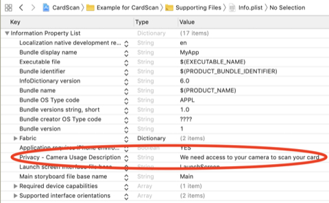

# React-native integration guide

CardScan React Native installation guide

Visit our website at [https://www.getbouncer.com](https://www.getbouncer.com) for examples. Native libraries for [android](https://github.com/getbouncer/cardscan-android) and [iOS](https://github.com/getbouncer/cardscan-ios) are also available in github.

CardScan is open source, and available under a free-to-try license. See the [license](./#license) section for details.

## Installation

### 1. Install the [react-native-cardscan](https://www.npmjs.com/package/react-native-cardscan) package from NPM

Add a dependency to `react-native-cardscan` in your `package.json` file. The latest version of `react-native-cardscan` can be added to your dependencies automatically by installing the SDK in the same directory as your `package.json` file.

```text
$ npm install react-native-cardscan
```

### 2. Install the iOS dependencies into your `ios` directory

Add the `CardScan` and `react-native-cardscan` pods to the `~/ios/Podfile` file in your app

```ruby
target 'Your App' do
  ...
  pod 'CardScan'
  pod 'react-native-cardscan', :path => '../node_modules/react-native-cardscan/react-native-cardscan.podspec'
end
```

_More installation options for iOS can be found in the **Installation** section of the_ [_iOS integration guide_](../ios-integration-guide/)_._

### 3. Link native dependencies

For react-native version 0.59 and below, follow the [linking native dependencies](link-native-dependencies.md) guide.

### 4. Install the android native library

_Note: You will need a username and password to set up these repositories. Please contact_ [_license@getbouncer.com_](mailto:license@getbouncer.com) _to request credentials._

Add the CardVerify repository to the android section of your react-native project. In your `android/build.gradle` file, append the following to repositories:

```groovy
repositories {
    // ...
    mavenCentral()
}
```

Add the cardverify dependencies to the android section of your react-native project. In your `android/app/build.gradle` file, append the following to dependencies:

```groovy
dependencies {
    implementation "com.getbouncer:cardscan-ui:2.1.0001"
    implementation "com.getbouncer:scan-payment-card-detect:2.1.0001"
    implementation "com.getbouncer:scan-payment-ocr:2.1.0001"
    implementation "com.getbouncer:tensorflow-lite:2.1.0001"
}
```

Please add the following to your `android/app/build.gradle` file in the `android` section:

```groovy
aaptOptions {
    noCompress "tflite"
}
```

#### Alternative camera implementations

By default, bouncer uses the Android Camera 1 API. To use Camera2 or CameraX, add one of the following imports:

```groovy
implementation "com.getbouncer:scan-camerax:2.1.0001"

// OR

implementation "com.getbouncer:scan-camera2:2.1.0001"
```

## Configuration

### 1. Create an API key

Go to the [Bouncer API console](https://api.getbouncer.com/console) and create an API key.

### 2. Configure Android

Open `android/app/src/main/java/[...]/MainApplication.java` and add the following lines to the end of the `onCreate()` method.

```java
import com.getbouncer.RNCardscanModule;

// ...

public class MainApplication extends Application implements ReactApplication {

  // ...

  public void onCreate() {

    // ...

    // set your generated API key
    RNCardscanModule.apiKey = "<your_api_key_here>";

    // set to true for experimental name extraction
    RNCardscanModule.enableNameExtraction = false;

    // set to true for experimental expiry extraction
    RNCardscanModule.enableExpiryExtraction = false;

    // set to true to display an "Enter Card Manually" button
    RNCardscanModule.enableEnterCardManually = false;
  }
}
```

### 3. Configure iOS Permissions

CardScan uses the device camera to scan cards, so you'll need to add a description of camera usage to your `Info.plist` file:



The string you add here will be what CardScan displays to your users when CardScan first prompts them for permission to use the camera.

Alternatively, you can add this permission directly to your Info.plist file:

```markup
<key>NSCameraUsageDescription</key>
<string>We need access to your camera to scan your card</string>
```

### 4. Configure iOS



In your `AppDelegate.swift` file, Add an import for `CardVerify`, and set your API key.

```swift
import UIKit
import CardScan

@UIApplicationMain
class AppDelegate: UIResponder, UIApplicationDelegate {

    func application(_ application: UIApplication, didFinishLaunchingWithOptions launchOptions: [UIApplicationLaunchOptionsKey: Any]?) -> Bool {
         Bouncer.configure(apiKey: "<your_api_key_here>") 
        // do any other necessary launch configuration
        return true
    }
}
```



In your `AppDelegate.m` file, Add an import for `CardVerify`, and set your API key.

```objectivec
#import "AppDelegate.h"
...
@import CardScan;

@implementation AppDelegate

- (BOOL)application:(UIApplication *)application didFinishLaunchingWithOptions:(NSDictionary *)launchOptions
{
  // ...
  [ScanViewController configureWithApiKey:@"<your_api_key_here>"];

  return YES;
}
```



## Using

react-native-cardscan exposes two static methods on the `CardScan` object, `isSupportedAsync()` and `scan()`.

To determine if the device supports CardScan, use the `isSupportedAsync()` method. For example,

```javascript
import Cardscan from 'react-native-cardscan';

Cardscan.isSupportedAsync()
  .then(supported => {
    if (supported) {
      // YES, show scan button
    } else {
      // NO
    }
  })
```

To scan a card, use the `scan()` method. For example,

```javascript
import Cardscan from 'react-native-cardscan';

Cardscan.scan()
  .then(({action, payload, canceled_reason}) => {
    if (action === 'scanned') {
      const { number, expiryMonth, expiryYear, issuer, legalName } = payload;
      // Display information
    } else if (action === 'canceled') {
      if (canceled_reason === 'enter_card_manually') {
        // the user elected to enter a card manually
      } else if (canceled_reason === 'camera_error') {
        // there was an error with the camera
      } else if (canceled_reason === 'fatal_error') {
        // there was an error during the scan
      } else if (canceled_reason === 'user_canceled') {
        // the user canceled the scan
      } else {
        // the scan was canceled for an unknown reason
      }
    } else if (action === 'skipped') {
      // User skipped
    } else if (action === 'unknown') {
      // Unknown reason for scan canceled
    }
  })
```

## Example app

An example application is included in the [react-native-cardscan github repository](https://github.com/getbouncer/react-native-cardscan).

Inside the `example` directory, you can find an example React Native project that you can run.

To run the example app, do the following:

* `$ cd example`
* `$ npm install`
* Add your API key to `android/app/src/main/java/com/getbouncer/example/MainApplication.java` and `ios/example/AppDelegate.m`.
* Point the android app to the SDK: create a file `example/android/local.properties` with a line

  ```text
  sdk.dir=<full_path_to_android_sdk>
  ```

* To run Android app: `react-native run-android`
* To run iOS app: `react-native run-ios`

## Troubleshooting

See the [troubleshooting](troubleshooting.md) documentation.

## Authors

Adam Wushensky, Sam King, Zain ul Abi Din, Jaime Park, and Stefano Suryanto

## License

This library is available under paid and free licenses. See the [LICENSE](https://github.com/getbouncer/cardscan-android/blob/master/LICENSE) file for the full license text.

### Quick summary

In short, this library will remain free forever for non-commercial applications, but use by commercial applications is limited to 90 days, after which time a licensing agreement is required. We're also adding some legal liability protections.

After this period commercial applications need to convert to a licensing agreement to continue to use this library.

Details of licensing \(pricing, etc\) are available at [https://getbouncer.com/pricing](https://getbouncer.com/pricing), or you can contact us at [license@getbouncer.com](mailto:license@getbouncer.com).

### More detailed summary

What’s allowed under the license:

* Free use for any app for 90 days \(for demos, evaluations, hackathons, etc\).
* Contributions \(contributors must agree to the [Contributor License Agreement](https://github.com/getbouncer/cardscan-android/blob/master/Contributor%20License%20Agreement)\)
* Any modifications as needed to work in your app

What’s not allowed under the license:

* Commercial applications using the license for longer than 90 days without a license agreement.
* Using us now in a commercial app today? No worries! Just email [license@getbouncer.com](mailto:license@getbouncer.com) and we’ll get you set up.
* Redistribution under a different license
* Removing attribution
* Modifying logos
* Indemnification: using this free software is ‘at your own risk’, so you can't sue Bouncer Technologies, Inc. for problems caused by this library

Questions? Concerns? Please email us at [license@getbouncer.com](mailto:license@getbouncer.com) or ask us on [slack](https://getbouncer.slack.com/).

