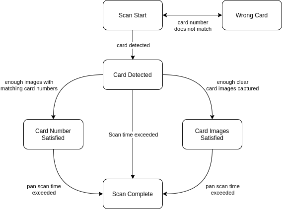

# Advanced Customization

Parts of the scan flow can be customized to perform better on slower devices at the expense of some user experience on faster devices. These customization options are available in the `VerifyConfig` class provided by the `cardverify-ui` android module.

The scan runs as a state machine, and transitions between states based on collected images during the scan.

## State machine description

The state machine consists of multiple states during which different tasks are performed.

### Scan Start

The scanner is looking for a card. It will transition out of this state as soon as a card is found.

### Card Detected

The scanner has seen a card, so the total scan timer starts. During this period, the scanner will save images to memory that contain a clear, centered card. It will also attempt to extract the card number from these images.

### Card Number Satisfied

This state is reached when the desired number of images with matching card numbers has been found. During this state, the scanner will continue saving images of clearly focused, centered cards to memory.

### Card Images Satisfied

This state is reached when the desired number of clearly focused, centered card images have been saved to memory. During this state, the scanner will continue to extract card numbers from images.

### Scan Complete

This state can be reached in the following conditions:
1. The overall scan time limit has elapsed
1. The card number is satisfied or the card images are satisfied (but not both), and the card number scan time limit has elapsed
1. The card number is satisfied and the card images are satisfied

## Configuration

The timeouts and desired counts are driven by values in the `VerifyConfig` object.

### Overall scan time limit

Bouncer imposes a maximum amount of time that a scan can run for once a card has been detected. By default, this is set to 10 seconds. For slower devices, this can be increased to improve the accuracy of the name and expiry extraction.

| field | default value |
| ----- | ------------- |
| VerifyConfig.PAN_AND_CARD_SEARCH_DURATION | `10.seconds` |

### Card number scan time limit

This field describes the maximum amount of time the scanner should continue looking for a card number once the desired number of images with a clearly focused, centered card have been found. It also describes the maximum duration for which the scanner should continue looking for images with clearly focused, centered cards once the card number has been found.

| field | default value |
| ----- | ------------- |
| VerifyConfig.PAN_SEARCH_DURATION | `5.seconds` |

### Desired card number agreement

The desired card number agreement field indicates how many images with matching pans are needed before the card number is considered to be satisfied. If this number of images with matching card numbers is found, the scan will stop extracting the card number.

| field | default value |
| ----- | ------------- |
| VerifyConfig.DESIRED_PAN_AGREEMENT | `5` |

### Minimum card number agreement

The minimum card number agreement field indicates how many images with matching pans are required before the scan can complete. If less that this number of images have been found, the scan will run until the overall time limit is reached.

| field | default value |
| ----- | ------------- |
| VerifyConfig.MINIMUM_PAN_AGREEMENT | `2` |

### Desired focused card image count

This field describes the desired number of images with a focused, centered card for name and expiry extraction. Once this number of images has been captured, the scan will stop saving these images to memory.

| field | default value |
| ----- | ------------- |
| VerifyConfig.DESIRED_SIDE_COUNT | `8` |

### Duration to show the wrong card state

If the wrong card is scanned, the scanner will display the wrong card state for this amount of time before transitioning back to the scan start state.

| field | default value |
| ----- | ------------- |
| VerifyConfig.WRONG_CARD_DURATION | `2.seconds` |
