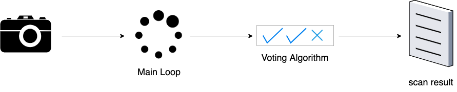
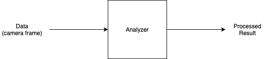
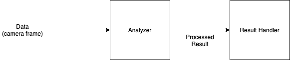
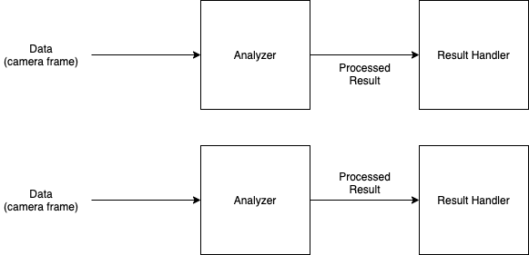
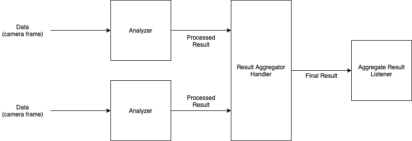
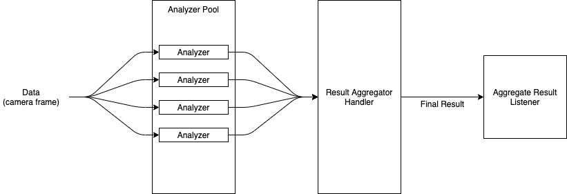
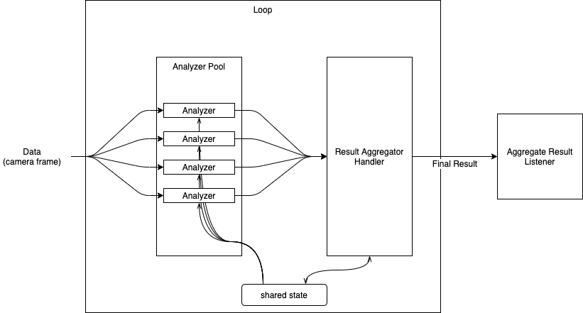
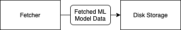
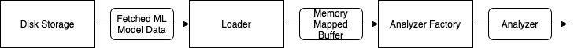
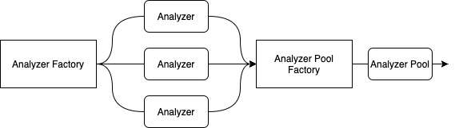

# Architecture guide

## Overview

The CardScan framework operates like a pipeline. Images from a data source \(e.g. a Camera\) are processed by a pool of analyzers in a loop. The results from those analyzers are aggregated together by a voting algorithm, and a final result is returned to the app.



The pipeline consists of the following basic concepts:

1. [Camera Adapters](architecture-overview.md#camera-adapters)
2. [Analyzers](architecture-overview.md#analyzers)
3. [Result Handlers](architecture-overview.md#result-handlers)
4. [Parallel Analyzers](architecture-overview.md#parallel-analyzers)
5. [Result Aggregation](architecture-overview.md#result-aggregation)
6. [Analyzer Pools](architecture-overview.md#analyzer-pools)
7. [Loops](architecture-overview.md#loops)
8. [Fetchers](architecture-overview.md#fetchers)
9. [Loaders and Analyzer Factories](architecture-overview.md#loaders-and-analyzer-factories)

## Camera Adapters

First and foremost, CardVerify is used to process images from a device camera. The [scan-camera](https://github.com/getbouncer/cardscan-android/tree/master/scan-camera) android module provides an abstraction around the Camera1 and Camera2 android APIs. It provides a simple interface by which the camera can be initialized, attached to a preview `View`, and provide a stream of images to process.

### Example

This code example uses a `Camera2Adapter` to stream preview images from the device camera and display the preview in a `TextureView`.

```kotlin
class MyCameraActivity : AppCompatActivity(), CameraErrorListener {
    private val cameraAdapter by lazy {
        Camera2Adapter(
            activity = this,
            previewView = textureView, // A TextureView where the preview will show. If null, no preview will be shown.
            minimumResolution = MINIMUM_RESOLUTION, // the minimum image resolution that should be streamed.
            cameraErrorListener = this
        )
    }

    /**
     * Call this method to start streaming images from the camera.
     */
    fun startProcessingCameraImages() {
        cameraAdapter.bindToLifecycle(this)
        cameraAdapter.getImageStream().collect { processCameraImage(it) }
    }

    private fun processCameraImage(previewFrame: Bitmap) {
        // Do something with the preview frame
    }

    override fun onCameraOpenError(cause: Throwable?) {
        // The camera could not be opened
    }

    override fun onCameraAccessError(cause: Throwable?) {
        // The camera could not be accessed
    }

    override fun onCameraUnsupportedError(cause: Throwable?) {
        // the camera is not supported on this device.
    }
}
```

## Analyzers

Analyzers represent the smallest single unit of the pipeline, the ML models. Analyzers take a single input, process that input, and return a single output.



## Result Handlers

Result handlers take an input and result \(often from an analyzer\), and do _something_ with that result. For example, a result handler might perform a voting algorithm or update the UI.



## Parallel Analyzers

With TensorFlow Lite, ML models perform better when multiple inference engines run in parallel. To process camera images as fast as possible, the framework runs multiple analyzers in parallel on the camera frames. This maximizes CPU usage and image throughput.



## Result Aggregation

Using OCR to extract a payment card number as an example, we only need a single result from this process, the payment card number. The CardVerify SDK uses a `ResultAggregator` to run a voting algorithm on the results from each camera frame.

This is a specialized version of a `ResultHandler` which handles multiple results from multiple ML models running in parallel. Once aggregation is complete \(e.g. voting has decided on a card number\), the aggregator sends the final result to a listener.



## Analyzer Pools

It takes time to load ML models into memory and create an inference engine. Analyzer pools work like a thread pool in that multiple analyzers are created, and then used as needed. The CardVerify SDK creates a pool of analyzers at the beginning of the scan process that can be re-used to process images from the camera.



## Loops

Loops tie analyzers and result aggregators together with a shared state. The loop provides an interface for accepting images from the camera or other data source, processes those images through a pool of analyzers, and finally collects the results in a result aggregator.

Analyzers are able to read the shared state from the loop, while the result aggregator can read and update the state. This allows for coordination between the result aggregator and the analyzers without strong coupling.



## Fetchers

ML model analyzers can be created from multiple sources:

* Resources packaged with the SDK
* Downloaded from fixed URLs
* Downloaded from CDNs using signed URLs
* Downloaded from CDNs based on a server-driven configuration

Fetchers provide the means to get the ML model data \(TensorFlow Lite files\) and store it locally on disk for faster future retrieval.



## Loaders and Analyzer Factories

Loaders read data from disk and prepare it to be read into memory by creating a `MappedByteBuffer` of the data stored on disk.

Analyzer Factories use Loaders to create instances of TensorFlow Lite inference engines using the byte buffer.



Analyzer Pools are created using an Analyzer Factory. An `AnalyzerPoolFactory` uses an analyzer factory to create multiple instances of analyzers, which it adds to a pool.



