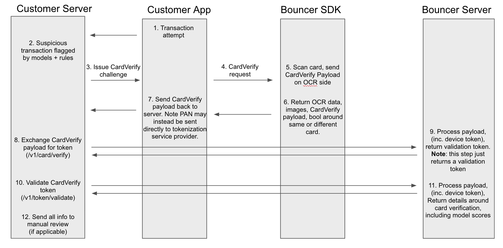
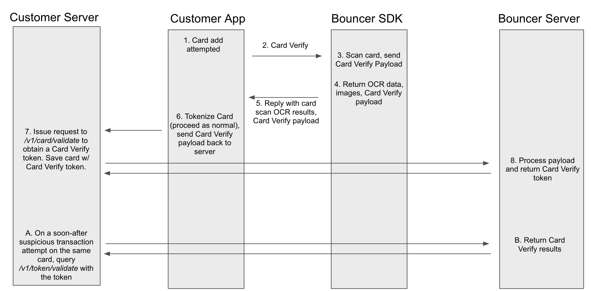

# Integration Overview

### Role of the **Bouncer Mobile SDKs:**

* Scan the number side of a card
* Generate a Card Verify payload based off of the scan. The payload contains intermediary fraud model results that our server needs to make a final decision.
* Return the details of the scanned card and the Card Verify Payload for the server-to-server call

**Note:** The Bouncer SDK will not directly expose whether this was a legitimate scan of a real card to the client App. It’ll be up to the client App to pass the Card Verify Payload back to the client servers and make a subsequent server to server call to get the validation results.

### **The high-risk transaction UX**

When your app detects a high-risk transaction, rather than blocking this transaction you can verify that their card is genuine. From a UX perspective, Bouncer provides two activities to help with this: a security explanation activity and an activity for scanning and verifying cards. Depending on the outcome of the scanning process, your app will either accept the transaction and let it proceed, or block it, optionally providing the user with other options.

### **Role of the Bouncer Server:**

* Verify the Card Verify payload generated by the Bouncer mobile SDK and return results of the scan
* Endpoints
  * \`\`[`/v1/card/verify`](rest-apis/v1-card-verify.md) ``\(server-to-server\): Processes the payload and returns a validation token
  * \`\`[`/v1/token/validate` ](rest-apis/validating-a-card-verify-token.md)\(server-to-server\): returns scan details

### High level diagram \(transaction-time challenge\)

### High level diagram \(Scan card up front, verify card if necessary later\)

Card scanning to extract the PAN, when used top of funnel during user onboarding, has demonstrably shown a significant conversion bump by itself. Some implementors may want to use Card Verify to scan all cards, and only verify whether the scan is fraudulent or not later down the line if the user engages in a risky transaction. The following digram shows the typical setup for such a use case

