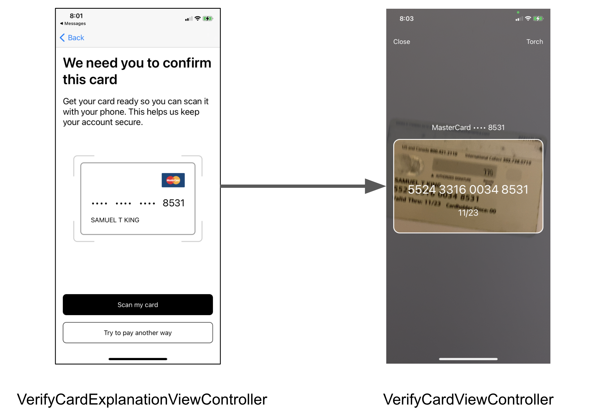

# iOS integration guide

## Requirements

* Xcode 11 or higher
* iOS 11.2 or higher
* iOS 13 or higher for our name and expiration models. The number model will

  work on older versions of iOS and it will always return nil for the name and

  expiration fields.

## iPad Support

CardScan defaults to a `formSheet` for the iPad, which handles all screen orientations and autorotation correctly. However, if you'd like to use it in full screen mode instead, make sure to select the `Requires full screen` option in your `Info.plist` file via XCode, or else non-portrait orientations won't work.

## Installation

CardVerify is published to the bouncer private repositories. Please request access to this repository by emailing [license@getbouncer.com](mailto:license@getbouncer.com) with a request for access.

CardVerify is available through [CocoaPods](https://cocoapods.org/). To install it, simply add the following line to your Podfile:

```bash
pod 'CardVerify', :http => 'https://api.getbouncer.com/v1/downloads/sdk/card_verify/<your_api_key_here>/cardverify-ios-2.0.7.tgz'
```

Next, install the new pod. From a terminal, run:

```bash
pod install
```

When using Cocoapods, you use the `.xcworkspace` instead of the `.xcodeproj`. Again from the terminal, run:

```bash
open YourProject.xcworkspace
```

##### Note: The Podfile can specify the iOS platform target to be lower than 11.2. However, as stated in the requirements CardVerify will only run on iOS 11.2 or higher. 

## Set up permissions

CardScan uses the camera, so you'll need to add an description of camera usage to your Info.plist file:


The string you add here will be what CardScan displays to your users when CardScan first prompts them for permission to use the camera.


Alternatively, you can add this permission directly to your Info.plist file:

```markup
<key>NSCameraUsageDescriptionkey>
<string>We need access to your camera to scan your cardstring>
```

## Configure the CardVerify module

CardVerify can be configured and run through Swift or Objective-C. CardVerify requires an API key, which can be generated for your app through the [Bouncer API console](https://api.getbouncer.com/console). _Note that for CardVerify, you will need permissions added to your API key to perform validation. Please contact_ [_support@getbouncer.com_](mailto:support@getbouncer.com) _once you've created your API key to have permissions added._

The CardScan SDK will send anonymous stats to Bouncer's servers. [This code snippet](https://github.com/getbouncer/cardscan-ios/blob/da77e36c49f1de4b678e7ecaab56cc1466602716/CardScan/Classes/ScanStats.swift#L50) shows what we send.

Apps using CardVerify must configure the library at launch.



Configure the library when your application launches by adding CardScan to your `AppDelegate.swift` file. If you are planning to use a navigation controller or support rotation, also be sure to add `supportedOrientationMaskOrDefault`.

```swift
import UIKit
import CardVerify

@UIApplicationMain
class AppDelegate: UIResponder, UIApplicationDelegate {

    func application(
        _ application: UIApplication,
        didFinishLaunchingWithOptions launchOptions: [UIApplicationLaunchOptionsKey: Any]?
    ) -> Bool {
        Bouncer.configure(apiKey: "<your_api_key_here>")
        // do any other necessary launch configuration
        return true
    }

    func application(
        _ application: UIApplication,
        supportedInterfaceOrientationsFor window: UIWindow?
    ) -> UIInterfaceOrientationMask {
        // if you are planning to embed scanViewController into a navigation
        // controller, put this line to handle rotations
        return ScanBaseViewController.supportedOrientationMaskOrDefault()
    }
}
```



## Using Bouncer Scan for high-risk transactions

There are two main uses for the CardVerify module: verify a card for a high-risk transaction and block if the scan is invalid using the `VerifyCardViewController` and proactively running fraud models when users add a card using the `VerifyCardAddViewController`.

### Using VerifyCardViewController for high-risk transactions

When you use the `VerifyCardViewController` the view controller will scan the card that your user is using for the high-risk transaction and block the transaction if the scan is invalid or detects telltale signs of fraud. If the user tries to scan a different card, the `VerifyCardViewController` will show an error state by outlining in red the card rectangle in the UI but will continue scanning to detect the correct card. Because this flow is for high-risk transactions, we provide a `VerifyCardExplanationViewController` that you can use to provide context for your users. The overall flow will look like this in most cases:



To use this flow:



```swift
import UIKit
import CardVerify

class ViewController: UIViewController, VerifyCardExplanationResult, VerifyCardResult {
    @IBAction func buttonPressed() {
        let vc = VerifyCardExplanationViewController()
        vc.lastFourForDisplay = self.lastFourOnFile
        vc.cardNetworkForDisplay = self.networkOfCardOnFile
        vc.expiryOrNameForDisplay = nameOnFile ?? expiryOnFile ?? ""
        vc.delegate = self
        
        self.present(vc, animated: true, completion: nil)
    }
    
    // MARK: -Explanation protocol implementation
    func userDidPressScanCardExplaination(_ viewController: VerifyCardExplanationViewController) {
        // Start the Verification process
        guard let lastFour = lastFourOnFile, let bin = binOnFile else { return }
        let vc = VerifyCardViewController(userId: "1234", lastFour: lastFour, bin: bin, cardNetwork: nil)
        vc.verifyCardDelegate = self
        
        viewController.present(vc, animated: true, completion: nil)
    }
    
    func userDidPressPayAnotherWayExplanation(_ viewController: VerifyCardExplanationViewController) {
        dismiss(animated: true)
        // let the user select a different card for this transaction
    }
    
    func userDidPressCloseExplanation(_ viewController: VerifyCardExplanationViewController) {
        dismiss(animated: true)
    }
    
    // MARK: -VerifyCardResult protocol
    func userCanceledVerifyCard(viewController: VerifyCardViewController) {
        dismiss(animated: true)
    }
    
    func fraudModelResultsVerifyCard(viewController: VerifyCardViewController, creditCard: CreditCard, encryptedPayload: String?, extraData: [String : Any]) {
        // at this point the scan is done, send the encrypted payload
        // to your servers which will get the result from Bouncer's
        // servers
    }
}
```



### Using VerifyCardAddViewController to verify cards when users add them

Our `VerifyCardViewController` flow verifies a specific card for a high-risk transaction and our `VerifyCardAddViewController` flow proactively verifies any cards that users add to your platform.  To support this flow, you should use the `VerifyCardAddViewController` instead of the `VerifyCardViewController`, and implement the optional `fraudModelResultsVerifyCardAdd` protocol method in the `VerifyCardAddResult` protocol:

```swift
import CardVerify
import UIKit

class VerifyAddFlowViewController: UIViewController, VerifyCardAddResult {
    @IBAction func buttonPressed() {
        // Start the Verification process
        let vc = VerifyCardAddViewController(userId: "1234")
        vc.cardAddDelegate = self
        vc.enableManualEntry = true
        
        viewController.present(vc, animated: true, completion: nil)
    }
    
    // MARK: -VerifyCardAddResult protocol implementation
    func userDidCancelCardAdd(_ viewController: UIViewController) {
        dismiss(animated: true)
    }
    
    func fraudModelResultsVerifyCardAdd(viewController: UIViewController, creditCard: CreditCard, encryptedPayload: String?, extraData: [String: Any]) {
        // at this point the scan is done, send the encrypted payload
        // to your servers which will get the result from Bouncer's
        // servers
        
        // depending on the results from Bouncer + if the card matched
        // what you were expecting handle each case
    }
    
    func userDidScanCardAdd(_ viewController: UIViewController, creditCard: CreditCard) {
        // The flow is complete, but fraud results aren't back yet
    }
    
    func userDidPressManualCardAdd(_ viewController: UIViewController) {
        // The user pressed "manual entry", go directly to the card entry form
    }
}
```

### Allowing users to scan any card during high risk transactions

You can also use `VerifyCardAddViewController` to verify high risk transactions without limiting them to the specific card that you have on file for the transaction. To support this flow, follow the instructions in the [Using VerifyCardAddViewController](./#using-verifycardaddviewcontroller-to-verify-cards-when-users-add-them) section, but disable the button that allows users to enter card details manually by setting the `enableManualEntry` property on the `VerifyCardAddViewController` to `false`



```swift
import UIKit
import CardVerify

class ViewController: UIViewController, VerifyCardExplanationResult, VerifyCardAddResult {
    @IBAction func buttonPressed() {
        let vc = VerifyCardExplanationViewController()
        vc.lastFourForDisplay = self.lastFourOnFile
        vc.cardNetworkForDisplay = self.networkOfCardOnFile
        vc.expiryOrNameForDisplay = nameOnFile ?? expiryOnFile ?? ""
        vc.delegate = self
        
        self.present(vc, animated: true, completion: nil)
    }
    
    // MARK: -Explanation protocol implementation
    func userDidPressScanCardExplaination(_ viewController: VerifyCardExplanationViewController) {
        // Start the Verification process
        let vc = VerifyCardAddViewController(userId: "1234")
        vc.cardAddDelegate = self
        vc.enableManualEntry = false
        
        viewController.present(vc, animated: true, completion: nil)
    }
    
    func userDidPressPayAnotherWayExplanation(_ viewController: VerifyCardExplanationViewController) {
        dismiss(animated: true)
        // let the user select a different card for this transaction
    }
    
    func userDidPressCloseExplanation(_ viewController: VerifyCardExplanationViewController) {
        dismiss(animated: true)
    }
    
    // MARK: -VerifyCardAddResult protocol
    func fraudModelResultsVerifyCardAdd(viewController: UIViewController, creditCard: CreditCard, encryptedPayload: String?, extraData: [String: Any]) {
        // at this point the scan is done, send the encrypted payload
        // to your servers which will get the result from Bouncer's
        // servers
        
        // depending on the results from Bouncer + if the card matched
        // what you were expecting handle each case
    }
    
    func userDidScanCardAdd(_ viewController: UIViewController, creditCard: CreditCard) {
        // don't do anything here, wait for the fraud result to come back
    }
    
    func userDidPressManualCardAdd(_ viewController: UIViewController) {
        preconditionFailure("Manual button not shown")
    }
    
    func userDidCancelCardAdd(_ viewController: UIViewController) {
        dismiss(animated: true)
    }
}
```



## Customizing

This library is built to be customized to fit your UI. We provide translated strings and localization support by default for all UI elements in our flows, and we provide mechanisms for you to set these strings yourself. See the [customization documentation](customizing-the-verify-ui-and-ux.md) for more details.

## Supporting more cards

Though Bouncer Scan supports several cards, you may need to add support for cards specific to your business, instructions can be found in the [card support docs](./).

## Authors

[Sam King](mailto:sam@getbouncer.com), Jaime Park, Adam Wushensky

## License

A licensing agreement is required to use this library.

* Details of licensing \(pricing, etc\) are available at

  [https://cardscan.io/pricing](https://cardscan.io/pricing), or you can contact

  us at [license@getbouncer.com](mailto:license@getbouncer.com).

All contributors must agree to the [CLA](https://github.com/getbouncer/cardscan-android/blob/master/Contributor%20License%20Agreement).
