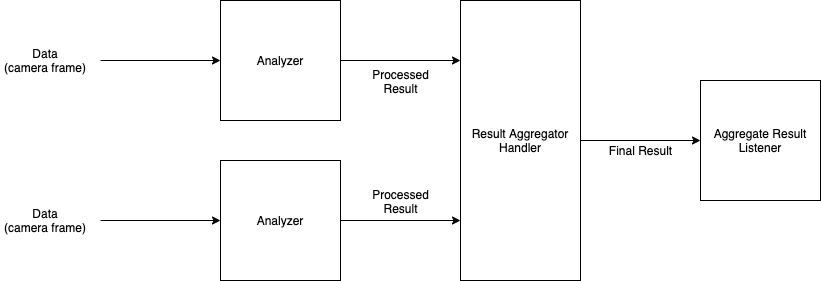
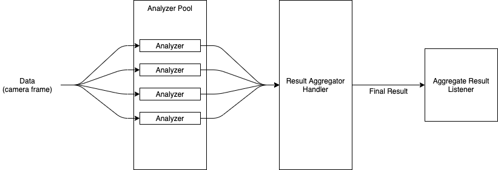
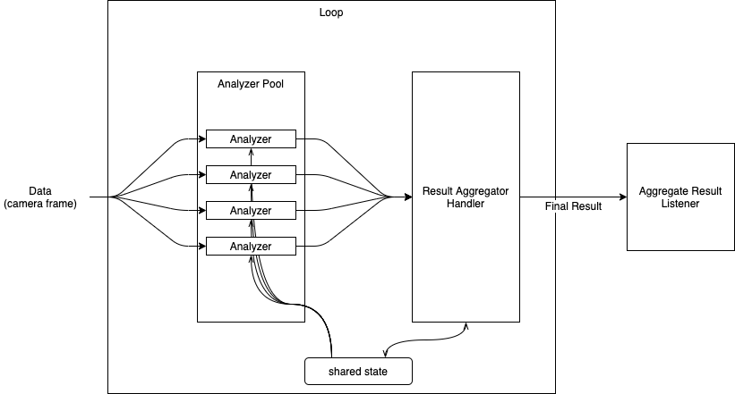

# Android architecture guide

## Overview

The CardScan framework operates like a pipeline. Images from a data source \(e.g. a Camera\) are processed by a pool of
analyzers in a loop. The results from those analyzers are aggregated together by a voting algorithm, and a final result
is returned to the app.


The pipeline consists of the following basic concepts:

1. [Camera Adapters](architecture-overview.md#camera-adapters)
2. [Analyzers](architecture-overview.md#analyzers)
3. [Result Handlers](architecture-overview.md#result-handlers)
4. [Parallel Analyzers](architecture-overview.md#parallel-analyzers)
5. [Result Aggregation](architecture-overview.md#result-aggregation)
6. [Analyzer Pools](architecture-overview.md#analyzer-pools)
7. [Loops](architecture-overview.md#loops)
8. [Fetchers](architecture-overview.md#fetchers)
9. [Loaders and Analyzer Factories](architecture-overview.md#loaders-and-analyzer-factories)

## Camera Adapters

First and foremost, CardScan is used to process images from a device camera. The
[scan-camera](https://github.com/getbouncer/cardscan-android/tree/master/scan-camera) android module provides an
abstraction around the Camera1 and Camera2 android APIs. It provides a simple interface by which the camera can be
initialized, attached to a preview `View`, and provide a stream of images to process.

### Example

This code example uses a `Camera2Adapter` to stream preview images from the device camera and display the preview in a
`TextureView`.




```kotlin
class MyCameraActivity : AppCompatActivity(), CameraErrorListener {
    private val cameraAdapter by lazy {
        Camera2Adapter(
            activity = this,

            // A TextureView where the preview will show. If null, no preview
            // will be shown.
            previewView = textureView,

            // the minimum image resolution that should be streamed.
            minimumResolution = MINIMUM_RESOLUTION,
            cameraErrorListener = this
        )
    }

    /**
     * Call this method to start streaming images from the camera.
     */
    fun startProcessingCameraImages() {
        cameraAdapter.bindToLifecycle(this)
        cameraAdapter.getImageStream().collect { processCameraImage(it) }
    }

    private fun processCameraImage(previewFrame: Bitmap) {
        // Do something with the preview frame
    }

    override fun onCameraOpenError(cause: Throwable?) {
        // The camera could not be opened
    }

    override fun onCameraAccessError(cause: Throwable?) {
        // The camera could not be accessed
    }

    override fun onCameraUnsupportedError(cause: Throwable?) {
        // the camera is not supported on this device.
    }
}
```





```java
public class MyCameraActivity
    extends AppCompatActivity
    implements CameraErrorListener {

    // Most cardscan models require a minimum resolution of 1280x720
    private static final Size MINIMUM_RESOLUTION = new Size(1280, 720);

    private CameraAdapter<Bitmap> cameraAdapterInstance = null;

    private CameraAdapter<Bitmap> getCameraAdapter() {
        if (cameraAdapterInstance == null) {
            cameraAdapterInstance = Camera2Adapter(
                /* activity */ this,

                // A TextureView where the preview will show. If null, no
                // preview will be shown.
                /* previewView */ (TextureView) findViewById(R.id.textureView),

                // the minimum image resolution that should be streamed.
                /* minimumResolution */ MINIMUM_RESOLUTION,
                /* cameraErrorListener */ this
            );
        }

        return cameraAdapterInstance;
    }

    /**
     * Call this method to start streaming images from the camera.
     */
    public void startProcessingCameraImages() {
        final CameraAdapter<Bitmap> cameraAdapter = getCameraAdapter();
        cameraAdapter.bindToLifecycle(this);
        cameraAdapter.getImageStream().collect(
            (bitmap, continuation) -> {
                processCameraImage(bitmap);
                Coroutine.resumeJava(continuation, Unit.INSTANCE);
                return Unit.INSTANCE;
            },
            new EmptyJavaContinuation<>()
        );
    }

    private void processCameraImage(@NotNull Bitmap previewFrame) {
        // Do something with the preview frame
    }

    @Override
    public void onCameraOpenError(@Nullable Throwable cause) {
        // The camera could not be opened
    }

    @Override
    public void onCameraAccessError(@Nullable Throwable cause) {
        // The camera could not be accessed
    }

    @Override
    public void onCameraUnsupportedError(@Nullable Throwable cause) {
        // the camera is not supported on this device.
    }
}
```




## Analyzers

Analyzers represent the smallest single unit of the pipeline, the ML models. Analyzers take a single input, process that
input, and return a single output.


## Result Handlers

Result handlers take an input and result \(often from an analyzer\), and do _something_ with that result. For example, a
result handler might perform a voting algorithm or update the UI.


## Parallel Analyzers

With TensorFlow Lite, ML models perform better when multiple inference engines run in parallel. To process camera images
as fast as possible, the framework runs multiple analyzers in parallel on the camera frames. This maximizes CPU usage
and image throughput.


## Result Aggregation

Using OCR to extract a payment card number as an example, we only need a single result from this process, the payment
card number. The CardScan SDK uses a `ResultAggregator` to run a voting algorithm on the results from each camera frame.

This is a specialized version of a `ResultHandler` which handles multiple results from multiple ML models running in
parallel. Once aggregation is complete \(e.g. voting has decided on a card number\), the aggregator sends the final
result to a listener.



## Analyzer Pools

It takes time to load ML models into memory and create an inference engine. Analyzer pools work like a thread pool in
that multiple analyzers are created, and then used as needed. The CardScan SDK creates a pool of analyzers at the
beginning of the scan process that can be re-used to process images from the camera.



## Loops

Loops tie analyzers and result aggregators together with a shared state. The loop provides an interface for accepting
images from the camera or other data source, processes those images through a pool of analyzers, and finally collects
the results in a result aggregator.

Analyzers are able to read the shared state from the loop, while the result aggregator can read and update the state.
This allows for coordination between the result aggregator and the analyzers without strong coupling.



## Fetchers

ML model analyzers can be created from multiple sources:

* Resources packaged with the SDK
* Downloaded from fixed URLs
* Downloaded from CDNs using signed URLs
* Downloaded from CDNs based on a server-driven configuration

Fetchers provide the means to get the ML model data \(TensorFlow Lite files\) and store it locally on disk for faster
future retrieval.


## Loaders and Analyzer Factories

Loaders read data from disk and prepare it to be read into memory by creating a `MappedByteBuffer` of the data stored on
disk.

Analyzer Factories use Loaders to create instances of TensorFlow Lite inference engines using the byte buffer.


Analyzer Pools are created using an Analyzer Factory. An `AnalyzerPoolFactory` uses an analyzer factory to create
multiple instances of analyzers, which it adds to a pool.


