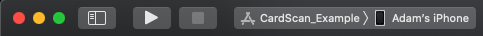

# iOS integration guide

## Requirements
* Objective C or Swift 4.0 or higher
* iOS 11.2 or higher \(supports development target of iOS 10.0 or higher\)
* iOS 13 or higher for our name and expiration models. The number model will work on older versions of iOS and it will
always return nil for the name and expiration fields.

## Demo
The [cardscan repository](https://github.com/getbouncer/cardscan-ios) contains a demonstration app for the CardScan
product. To build and install this library follow the following steps:

1. Clone the repository from github
   ```bash
   git clone --recursive https://github.com/getbouncer/cardscan-ios
   ```
   
1. Install the cocoapods in the Example directory
   ```bash
   cd Example
   pod install
   ```
   
1. Open the project in XCode and run the example

   * File → Open
   
   * Naviate to `Example/CardScan.xcworkspace`
    
1. Run the example using XCode

   * Select `CardScan_Example` and point it to your device
   
   * Click the play button to run the demo app on your device
    
     

## Installation

### CocoaPods
CardScan is available through [CocoaPods](https://cocoapods.org/). To install it, add the following line to your Podfile:

```bash
pod 'CardScan'
```

Or if you're using Stripe:

```bash
pod 'CardScan'
pod 'CardScan/Stripe'
```

Next, install the new pod. From a terminal, run:

```bash
pod install
```

When using Cocoapods, you use the `.xcworkspace` instead of the `.xcodeproj`. Again from the terminal, run:

```bash
open YourProject.xcworkspace
```

### Carthage
CardScan is also available through [Carthage](https://github.com/Carthage/Carthage). To install it, add the following
line to your Cartfile:

```text
github "getbouncer/cardscan-ios" "master"
```

Follow the [Carthage instructions for building for iOS](https://github.com/Carthage/Carthage#if-youre-building-for-ios-tvos-or-watchos)

## Set up permissions
CardScan uses the camera, so you'll need to add an description of camera usage to your Info.plist file:


The string you add here will be what CardScan displays to your users when CardScan first prompts them for permission to
use the camera.


Alternatively, you can add this permission directly to your Info.plist file:

```markup
<key>NSCameraUsageDescriptionkey>
<string>We need access to your camera to scan your cardstring>
```

## Configure CardScan
CardScan can be configured and run through Swift or Objective-C. CardScan requires an API key, which can be generated
for your app through the [Bouncer API console](https://api.getbouncer.com/console).

The CardScan SDK will send anonymous stats to Bouncer's servers.
[This code snippet](https://github.com/getbouncer/cardscan-ios/blob/da77e36c49f1de4b678e7ecaab56cc1466602716/CardScan/Classes/ScanStats.swift#L50)
shows what we send.

### Swift
Configure the library when your application launches by adding CardScan to your `AppDelegate.swift` file. If you are
planning to use a navigation controller or support rotation, also be sure to add `supportedOrientationMaskOrDefault`.

```swift
import UIKit
import CardScan

@UIApplicationMain
class AppDelegate: UIResponder, UIApplicationDelegate {

    func application(_ application: UIApplication, didFinishLaunchingWithOptions launchOptions: [UIApplicationLaunchOptionsKey: Any]?) -> Bool {
        ScanViewController.configure(apiKey: "<your_api_key_here>") 
        // do any other necessary launch configuration
        return true
    }
    
    func application(_ application: UIApplication, supportedInterfaceOrientationsFor window: UIWindow?) -> UIInterfaceOrientationMask {
        // if you are planning to embed scanViewController into a navigation controller, 
        // put this line to handle rotations
        return ScanBaseViewController.supportedOrientationMaskOrDefault()
    }
}
```

### Objective C
Configure the library when your application launches by adding CardScan to your `AppDelegate.m` file.

```objectivec
#import "AppDelegate.h"
@import CardScan;

@implementation AppDelegate

- (BOOL)application:(UIApplication *)application didFinishLaunchingWithOptions:(NSDictionary *)launchOptions {
    // if you need to get an API key you can get one from here:
    // https://api.getbouncer.com/console
    [ScanViewController configureWithApiKey:@"<your_api_key_here>"];
    return YES;
}

@end
```

## Using CardScan
To use CardScan, create a `ScanViewController`, display it, and implement the `ScanDelegate` protocol to receive results
from the scan.

### Swift

```swift
import UIKit
import CardScan

class ViewController: UIViewController, ScanDelegate {
    override func viewWillAppear() {
        super.viewWillAppear()
        
        // It's important that this goes in viewWillAppear because the user may deny permission on the
        // ScanViewController, in which case the button must be hidden to avoid future presses.
        if !ScanViewController.isCompatible() {
            // Hide your "scan card" button because this device isn't compatible with CardScan
        }
    }
    
    @IBAction func scanCardButtonPressed() {
        guard let vc = ScanViewController.createViewController(withDelegate: self) else {
            print("This device is incompatible with CardScan")
            return
        }
        self.present(vc, animated: true)
    }

    func userDidSkip(_ scanViewController: ScanViewController) {
        self.dismiss(animated: true)
    }
    
    func userDidCancel(_ scanViewController: ScanViewController) {
        self.dismiss(animated: true)
    }
    
    func userDidScanCard(_ scanViewController: ScanViewController, creditCard: CreditCard) {
        let number = creditCard.number
        let expiryMonth = creditCard.expiryMonth
        let expiryYear = creditCard.expiryYear

        // If you're using Stripe and you include the CardScan/Stripe pod, you can get `STPCardParams`
        // directly from CardScan `CreditCard` objects, which you can use with Stripe's APIs
        let cardParams = creditCard.cardParams()

        // At this point you have the credit card number and optionally the expiry. You can either
        // tokenize the number or prompt the user for more information (e.g., CVV) before tokenizing.
        self.dismiss(animated: true)
    }
}
```

### Objective C

```objectivec
#import "ViewController.h"
@import Stripe;

@interface ViewController ()

@end

@implementation ViewController

- (void)viewDidLoad {
    [super viewDidLoad];
    if (![ScanViewController isCompatible]) {
         // Hide the "scan card" button because this device isn't compatible with CardScan       
    }
}

- (IBAction)scanCardPress:(id)sender {
    UIViewController *vc = [ScanViewController createViewControllerWithDelegate:self];
    [self presentViewController:vc animated:YES completion:nil];
}

- (void)userDidSkip:(ScanViewController * _Nonnull)scanViewController {
    [self dismissViewControllerAnimated:YES completion:nil];
}

- (void)userDidCancel:(ScanViewController * _Nonnull)scanViewController {
    [self dismissViewControllerAnimated:YES completion:nil];
}

- (void)userDidScanCard:(ScanViewController * _Nonnull)scanViewController creditCard:(CreditCard * _Nonnull)creditCard {
    NSString *number = creditCard.number;
    NSString *expiryMonth = creditCard.expiryMonth;
    NSString *expiryYear = creditCard.expiryYear;
    
    // If you're using Stripe and you include the CardScan/Stripe pod, you can get `STPCardParams`
    // directly from CardScan `CreditCard` objects, which you can use with Stripe's APIs
    STPCardParams *cardParams = [creditCard cardParams];
    
    // At this point you have the credit card number and optionally the expiry. You can either
    // tokenize the number or prompt the user for more information (e.g., CVV) before tokenizing.
    [self dismissViewControllerAnimated:YES completion:nil];
}

@end
```

## Using CardScan on iOS 10
CardScan makes heavy use of CoreML, which Apple introduced in iOS 11. You can include the CardScan library in any
projects that support a development target of iOS 10.0 or higher, but it will only run on devices that are running iOS
11 or higher.

To check if a device supports CardScan at runtime, use the `ScanViewController.isCompatible` method:

### Swift
```swift
if !ScanViewController.isCompatible() {
    self.scanCardButton.isHidden = true
}
```

## Objective C

```objectivec
if (![ScanViewController isCompatible]) {
    self.scanCardButton.isHidden = true
}
```

## Customizing
This library is built to be customized to fit your UI. See the [customization documentation](ios-customization-guide.md).

## Supporting more cards
Though CardScan supports several cards, you may need to add support for cards specific to your business, instructions
can be found in the [card support docs](card-support.md).

## Authors
Sam King, Jaime Park, Zain ul Abi Din, Adam Wushensky, and Andy Li

## License
This library is available under paid and free licenses. See the
[LICENSE](https://github.com/getbouncer/cardscan-ios/blob/master/LICENSE) file for the full license text.

### Quick summary
In short, this library will remain free forever for non-commercial applications, but use by commercial applications is
limited to 90 days, after which time a licensing agreement is required. We're also adding some legal liability
protections.

After this period commercial applications need to convert to a licensing agreement to continue to use this library.

* Details of licensing \(pricing, etc\) are available at [https://cardscan.io/pricing](https://cardscan.io/pricing), or
you can contact us at [license@getbouncer.com](mailto:license@getbouncer.com).

### More detailed summary

What's allowed under the license:

* Free use for any app for 90 days \(for demos, evaluations, hackathons, etc\).
* Contributions \(contributors must agree to the
[Contributor License Agreement](https://github.com/getbouncer/cardscan-ios/blob/master/Contributor%20License%20Agreement))
* Any modifications as needed to work in your app

What's not allowed under the license:

* Commercial applications using the license for longer than 90 days without a license agreement.
* Using us now in a commercial app today? No worries! Just email [license@getbouncer.com](mailto:license@getbouncer.com)
and we’ll get you set up.
* Redistribution under a different license
* Removing attribution
* Modifying logos
* Indemnification: using this free software is ‘at your own risk’, so you can’t sue Bouncer Technologies, Inc. for
problems caused by this library

### Questions? Concerns?
Please email us at [license@getbouncer.com](mailto:license@getbouncer.com) or ask us on
[slack](https://getbouncer.slack.com/).

