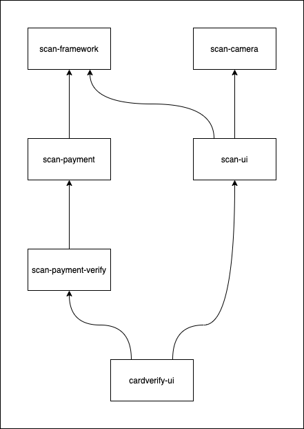

# Development
A guide to developing the CardVerify SDK and using some of its more advanced features.

## Contents
* [Code Organization](#code-organization)
* [Building](#building)
* [Running Unit Tests](#running-unit-tests)
* [Running Android Instrumentation Tests](#running-android-tests)
* [Releasing](#releasing)

## Code Organization
The CardVerify SDK is built from multiple android modules, each of which builds upon more base modules. The structure of
the modules used in CardVerify looks like this:



The CardVerify SDK consists of these modules as well as a demo app:
* [scan-framework](#scan-framework)
* [scan-camera](#scan-camera)
* [scan-payment](#scan-payment)
* [scan-payment-verify](#scan-payment-verify)
* [scan-ui](#scan-ui)
* [cardverify-ui](#cardverify-ui)
* [cardverify-demo](#cardverify-demo)

### scan-framework
The [scan-framework](https://github.com/getbouncer/scan-framework-android) module contains the framework used to scan images. See the [architecture document](https://github.com/getbouncer/scan-framework-android/tree/master/docs/architecture.md) for details on how it processes images from the camera.

### scan-camera
The [scan-camera](https://github.com/getbouncer/scan-camera-android) module contains the camera interfaces for setting up the camera on the device and receiving images from it. It also handles converting the images from the camera to a processable format.

### scan-payment
The [scan-payment](https://github.com/getbouncer/scan-payment-android) module contains the code for validating and managing payment cards.

### scan-payment-verify
The closed-source [scan-payment-verify](https://github.com/getbouncer/scan-payment-verify-android) module builds on top of the [scan-payment](https://github.com/getbouncer/scan-payment-android) module and contains the code for validating the authenticity of payment cards.

### scan-ui
The [scan-ui](https://github.com/getbouncer/scan-ui-android) module contains some common functionality shared between user interfaces for scanning cards. This provides the card viewfinder, debug overlay, and base scan activity.

### cardverify-ui
The closed-source [cardverify-ui](https://github.com/getbouncer/cardverify-ui-android) module builds on top of the [scan-ui](https://github.com/getbouncer/scan-ui-android) and [scan-payment-verify](https://github.com/getbouncer/scan-payment-verify-android) modules to provide user interfaces for scanning payment cards. Anything specific to the user interface of the CardVerify product lives in this library.

### cardverify-demo
The closed-source [cardverify-demo](https://github.com/getbouncer/cardverify-demo-android) app provides a demonstration for launching the CardVerify SDK as a separate activity and for integrating the CardVerify library into an existing activity.

## Building
Check out the project using `git`. Note that this project makes use of submodules, so a `recursive` clone is recommended.
```bash
git clone --recursive https://github.com/getbouncer/cardverify-ui-android
```

To build the project, run the following command:
```bash
./gradlew cardverify-ui:build
```

To create an AAR release of the app, run the following command:
```bash
./gradlew cardverify-ui:assembleRelease
```
This will place an AAR file in `cardverify-ui/build/outputs/aar`

## Contributing
These libraries follow a standard github contribution flow.

1. Create a new github feature branch
    ```bash
    git checkout -b <your_github_name>/<your_feature_name>
    ```

1. Make your code changes

1. Push your branch to origin
    ```bash
    git push --set-upstream origin <your_branch_name>
    ```

1. Create a new pull request on github, and tag appropriate owners.

1. Once you have approval, merge your branch into master and delete your feature branch from github.

## Running Unit Tests
Unit tests can be run from android studio or from the command line. To execute from the command line, run the following command:
```bash
./gradlew test
```

## Running Android Tests
Android tests can be run from android studio or from the command line. To execute from the command line, run the following command:
```bash
./gradlew connectedAndroidTest
```

Note that these tests require that you have an emulator running or a physical device connected to your machine via `ADB`.

## Releasing
See the [release](android-release-guide.md) documentation.