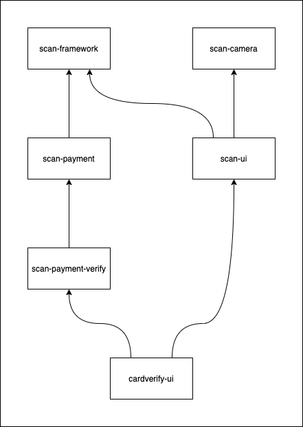

# Android development guide

## Contents

* [Code Organization](android-development-guide.md#code-organization)
* [Building](android-development-guide.md#building)
* [Running Unit Tests](android-development-guide.md#running-unit-tests)
* [Running Android Instrumentation Tests](android-development-guide.md#running-android-tests)
* [Releasing](android-development-guide.md#releasing)

## Code Organization

The CardVerify SDK is built from multiple android modules, each of which builds upon more base modules. The structure of the modules used in CardVerify looks like this:



The CardVerify SDK consists of these modules as well as a demo app:

* [scan-framework](android-development-guide.md#scan-framework)
* [scan-camera](android-development-guide.md#scan-camera)
* [scan-payment](android-development-guide.md#scan-payment)
* [scan-payment-verify](android-development-guide.md#scan-payment-verify)
* [scan-ui](android-development-guide.md#scan-ui)
* [cardverify-ui](android-development-guide.md#cardverify-ui)
* [cardverify-demo](android-development-guide.md#cardverify-demo)

### scan-framework

The [scan-framework](https://github.com/getbouncer/cardscan-android/tree/master/scan-framework) module contains the framework used to scan images. See the [architecture document]() for details on how it processes images from the camera.

### scan-camera

The [scan-camera](https://github.com/getbouncer/cardscan-android/tree/master/scan-camera) module contains the camera interfaces for setting up the camera on the device and receiving images from it. It also handles converting the images from the camera to a processable format.

### scan-payment

The [scan-payment](https://github.com/getbouncer/cardscan-android/tree/master/scan-payment) module contains the code for validating and managing payment cards.

### scan-payment-verify

The closed-source [scan-payment-verify](https://github.com/getbouncer/cardverify-android/tree/master/scan-payment-verify) module builds on top of the [scan-payment](https://github.com/getbouncer/cardscan-android/tree/master/scan-payment) module and contains the code for validating the authenticity of payment cards.

### scan-ui

The [scan-ui](https://github.com/getbouncer/cardscan-android/tree/master/scan-ui) module contains some common functionality shared between user interfaces for scanning cards. This provides the card viewfinder, debug overlay, and base scan activity.

### cardverify-ui

The closed-source [cardverify-ui](https://github.com/getbouncer/cardverify-android/tree/master/cardverify-ui) module builds on top of the [scan-ui](https://github.com/getbouncer/cardscan-android/tree/master/scan-ui) and [scan-payment-verify](https://github.com/getbouncer/cardverify-android/tree/master/scan-payment-verify) modules to provide user interfaces for scanning payment cards. Anything specific to the user interface of the CardVerify product lives in this library.

### cardverify-demo

The closed-source [cardverify-demo](https://github.com/getbouncer/cardverify-android/tree/master/demo) app provides a demonstration for launching the CardVerify SDK as a separate activity and for integrating the CardVerify library into an existing activity.

## Building

Check out the project using `git`. Note that this project makes use of submodules, so a `recursive` clone is recommended.

```bash
git clone --recursive https://github.com/getbouncer/cardverify-android
```

To build the project, run the following command:

```bash
./gradlew build
```

To create an AAR release of the app, run the following command:

```bash
./gradlew assembleRelease
```

This will place an AAR file in `cardverify-ui/build/outputs/aar`

## Contributing

These libraries follow a standard github contribution flow.

1. Create a new github feature branch

   ```bash
    git checkout -b <your_github_name>/<your_feature_name>
   ```

2. Make your code changes
3. Push your branch to origin

   ```bash
    git push --set-upstream origin <your_branch_name>
   ```

4. Create a new pull request on github, and tag appropriate owners.
5. Once you have approval, merge your branch into master and delete your feature branch from github.

## Running Unit Tests

Unit tests can be run from android studio or from the command line. To execute from the command line, run the following command:

```bash
./gradlew test
```

## Running Android Tests

Android tests can be run from android studio or from the command line. To execute from the command line, run the following command:

```bash
./gradlew connectedAndroidTest
```

Note that these tests require that you have an emulator running or a physical device connected to your machine via `ADB`.

## Releasing

See the [release]() documentation.

