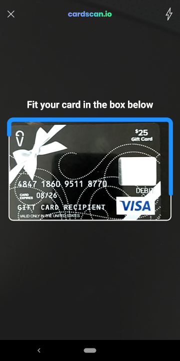
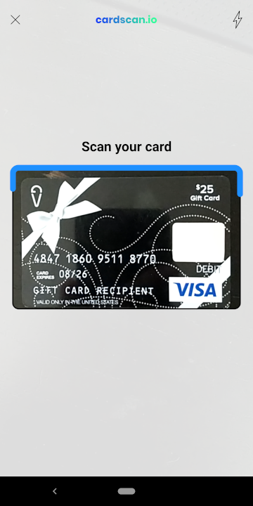
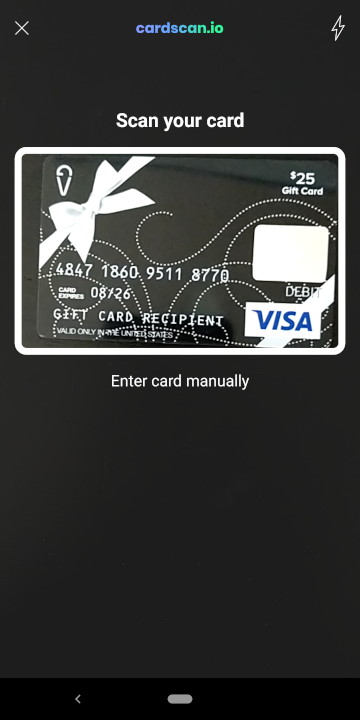
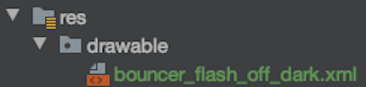
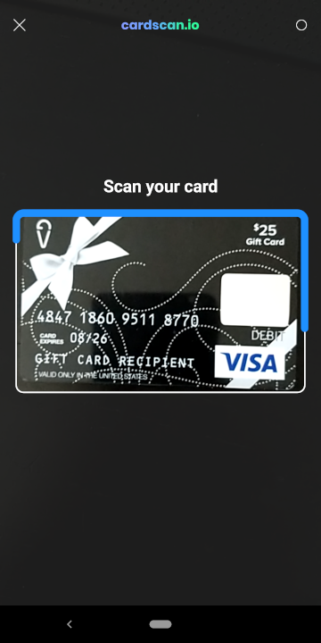
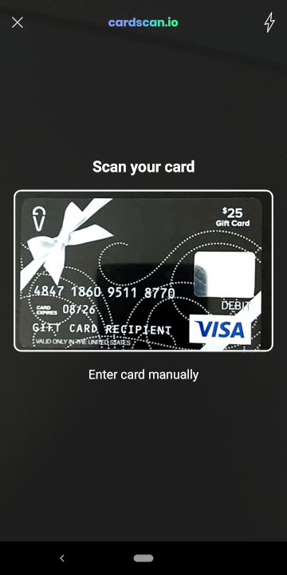

# Android customization guide

## Contents

* [Text and Localization](android-ui-customization-guide.md#text-and-localization)
* [Colors](android-ui-customization-guide.md#colors)
* [Dimensions](android-ui-customization-guide.md#dimensions)
* [Icons and Visual Elements](android-ui-customization-guide.md#icons-and-visual-elements)
* [Screen Elements](android-ui-customization-guide.md#screen-elements)

## Text and Localization

CardScan uses standard android XML configuration files to define strings displayed in the UI. This allows clients to override the default text values and localize the text.

The most up to date values and descriptions for these fields can be viewed in [GitHub](https://github.com/getbouncer/cardscan-android/blob/master/scan-ui/src/main/res/values/strings.xml).

### Overriding Defaults

The CardScan SDK uses the following text fields:

| Name | Description | Default Value |
| :--- | :--- | :--- |
| **`bouncer_card_scan_instructions`** | Text displayed above the scan window, instructing the user how to scan card | `Center your card in the frame` |
| **`bouncer_card_scan_security`** | Security notification displayed below the scan window | `Your card info is secure` |
| **`bouncer_enter_card_manually`** | Text shown at the bottom of the screen offering for the user to type in card details manually | `Enter card manually` |
| **`bouncer_scanned_wrong_card`** | Text displayed above the scan window when the wrong card is scanned | `Please scan the card ending in %1$s` |
| **`bouncer_camera_permission_denied_message`** | Message shown to the user when camera permission is denied | `Please allow camera access to scan your card` |
| **`bouncer_camera_permission_denied_ok`** | Affirmative button shown as part of the permission denied dialog | `OK` |
| **`bouncer_camera_permission_denied_cancel`** | Negative button shown as part of the permission denied dialog | `Cancel` |
| **`bouncer_error_camera_title`** | Title of the dialog shown to the user when an error using the camera occurs | `Camera Problem` |
| **`bouncer_error_camera_open`** | Message of the dialog shown to the user when an error starting the camera occurs | `The camera failed to turn on` |
| **`bouncer_error_camera_access`** | Message of the dialog shown to the user when an error accessing the camera occurs | `Permission was denied when turning on the camera` |
| **`bouncer_error_camera_unsupported`** | Message of the dialog shown to the user when the camera is not supported | `This device does not support the required camera features` |
| **`bouncer_error_camera_acknowledge_button`** | Affirmative button shown as part of the camera error dialog | `Close` |
| **`bouncer_api_key_invalid_title`** | Title of the dialog shown to the user when an invalid API key is specified | `Network Problem` |
| **`bouncer_api_key_invalid_message`** | Message of the dialog shown to the user when an invalid API key is specified | `Sorry, this API key is not valid.` |
| **`bouncer_api_key_invalid_ok`** | Affirmative button shown as part of the invalid API key dialog | `OK` |
| **`bouncer_name_and_expiry_initialization_error`** | Title of the dialog shown to the user when attempting to extract name and expiry from a card when models have not been warmed up | `Config Problem` |
| **`bouncer_name_and_expiry_initialization_error_message`** | Message of the dialog shown to the user when attempting to extract name and expiry from a card when models have not been warmed up | `Please initialize name/expiry models first in the warmup() function.` |
| **`bouncer_name_and_expiry_initialization_error_ok`** | Affirmative button shown as part of the name or expiry extraction error dialog | `OK` |
| **`bouncer_cardscan_logo`** | Accessibility description of the CardScan.io logo | `cardscan.io logo` |
| **`bouncer_security_description`** | Accessibility description of the security notification lock icon | `lock icon` |
| **`bouncer_preview_description`** | Accessibility description of the camera preview window | `card scanning window` |
| **`bouncer_debug_description`** | Accessibility description of the debug preview window | `card debug window` |
| **`bouncer_close_button_description`** | Accessibility description of the close button | `close button` |
| **`bouncer_card_view_finder_description`** | Accessibility description of the view finder window | `card view finder` |

To override any of these values with your own, Create a new file in your app's resources \(`src/main/res/values/strings.xml`\) and define the strings you would like to override. The library will default to the values in your app.

#### Example

To change the instructions, add the following to your strings.xml resource file:

```markup
<resources>
    <string name="bouncer_card_scan_instructions">Fit your card in the box below</string>
</resources>
```

Will result in the following change to the interface:



### Localization

All the fields listed above can be localized similarly to how they can be overridden. To localize the text, create a new file in your app's resources \(`src/main/res/values-<locale>/strings.xml`\) and define the strings you would like to localize. The library will default to the values in your app for each locale.

#### Example

To provide support for French localization, create the file `src/main/res/values-fr/strings.xml` with the following values:

```markup
<resources>
    <string name="bouncer_card_scan_instructions">Centrez votre carte dans le cadre</string>
    <string name="bouncer_card_scan_security">Les informations de votre carte sont sécurisées</string>
    <string name="bouncer_enter_card_manually">Tapez le numéro de la carte</string>
    <string name="bouncer_scanned_wrong_card">Veuillez scanner la carte se terminant par %1$s</string>
</resources>
```

English locale devices will still get the default values, and French locale devices will see the French translations.

Please note that GoogleTranslate was used to create the above translations. We strongly recommend using translators fluent in the desired language.

#### Left to Right Support

CardScan fully supports left-to-right languages.

## Colors

CardScan uses standard android XML configuration files to define colors displayed in the UI. This allows clients to override the default colors to better match the theme of their app.

The most up to date values and descriptions for these fields can be viewed in [GitHub](https://github.com/getbouncer/cardscan-android/blob/master/scan-ui/src/main/res/values/colors.xml).

The CardScan SDK uses the following color definitions:

| Name | Description | Default Value |
| :--- | :--- | :--- |
| **`bouncerCardPanColor`** | The text color of the card number displayed over the scan window | `@android:color/white` |
| **`bouncerCardPanOutlineColor`** | The outline color of the card number displayed over the scan window | `@android:color/black` |
| **`bouncerCardExpiryColor`** | The text color of the card expiry displayed over the scan window | `@android:color/white` |
| **`bouncerCardExpiryOutlineColor`** | The outline color of the card expiry displayed over the scan window | `@android:color/black` |
| **`bouncerEnterCardManuallyColorDark`** | The color of the Enter Card Manually text displayed at the bottom of the screen when the background is a dark color | `@android:color/white` |
| **`bouncerEnterCardManuallyColorLight`** | The color of the Enter Card Manually text displayed at the bottom of the screen when the background is a light color | `@android:color/black` |
| **`bouncerInstructionsColorDark`** | The color of the instructions text above the scan window when the background is a dark color | `@android:color/white` |
| **`bouncerInstructionsColorLight`** | The color of the instructions text above the scan window when the background is a light color | `@android:color/black` |
| **`bouncerSecurityColorDark`** | The color of the security notification shown below the scan window when the background is a dark color | `@android:color/white` |
| **`bouncerSecurityColorLight`** | The color of the security notification shown below the scan window when the background is a light color | `@android:color/black` |
| **`bouncerNotFoundBackground`** | The background color of the scan window when no card is visible | `#DD222222` |
| **`bouncerFoundBackground`** | The background color of the scan window when a card has been found and the scan is started | `#DD222222` |
| **`bouncerCorrectBackground`** | The background color of the scan window when a card has been found and the scan is completed | `#DD222222` |
| **`bouncerWrongBackground`** | The background color of the scan window when a card has been found that does not match the required card | `#DD222222` |
| **`bouncerNotFoundOutline`** | The outline color of the scan window when no card is visible | `#FFFFFF` |
| **`bouncerFoundOutline`** | The outline color of the scan window when a card has been found and the scan is started | `#1E90FF` |
| **`bouncerCorrectOutline`** | The outline color of the scan window when the scan has completed | `#2ED573` |
| **`bouncerWrongOutline`** | The outline color of the scan window when a card has been found that does not match the required card | `#FF2222` |
| **`bouncerCloseButtonDarkColor`** | The color of the close button when the background is a dark color | `#FFFFFF` |
| **`bouncerFlashButtonDarkColor`** | The color of the torch button when the background is a dark color | `#FFFFFF` |
| **`bouncerCloseButtonLightColor`** | The color of the close button when the background is a light color | `#000000` |
| **`bouncerFlashButtonLightColor`** | The color of the torch button when the background is a light color | `#000000` |
| **`bouncerDebugHighConfidence`** | When using debug mode, the color of boxes to draw around high confidence text | `#00FF00` |
| **`bouncerDebugMediumConfidence`** | When using debug mode, the color of boxes to draw around medium confidence text | `#DDDD00` |
| **`bouncerDebugLowConfidence`** | When using debug mode, the color of boxes to draw around low confidence text | `#FF0000` |

To override any of these values with your own, create a new file in your app's resources \(`src/main/res/values/colors.xml`\) and define the colors you would like to override. The library will default to the values in your app.

### Example:

To change the background scan color to white with a black border around the scan window, add the following to your color resource file:

```markup
<resources>
    <color name="bouncerNotFoundBackground">#DDFFFFFF</color>
    <color name="bouncerFoundBackground">#DDFFFFFF</color>
    <color name="bouncerCorrectBackground">#DDFFFFFF</color>
    <color name="bouncerWrongBackground">#DDFFFFFF</color>

    <color name="bouncerNotFoundOutline">#000000</color>
    <color name="bouncerFoundOutline">#1E90FF</color>
    <color name="bouncerCorrectOutline">#2ED573</color>
    <color name="bouncerWrongOutline">#FF2222</color>
</resources>
```

This will result in the following change to the interface:



## Dimensions

CardScan uses standard android XML configuration files to define dimensions used to lay out the UI, including padding, text size, line widths, and more. This allows clients to override the default dimensions to better match the theme of their app.

The most up to date values and descriptions for these fields can be viewed in [GitHub](https://github.com/getbouncer/cardscan-android/blob/master/scan-ui/src/main/res/values/dimensions.xml).

The CardScan SDK uses the following dimension definitions:

| Name | Description | Default Value |
| :--- | :--- | :--- |
| **`bouncerViewFinderMargin`** | The minimum distance between the edge of the screen and the view finder window | `16dp` |
| **`bouncerViewFinderVerticalBias`** | The vertical position of the view finder. Lower numbers shift the view finder towards the top of the screen | `0.5` |
| **`bouncerViewFinderHorizontalBias`** | The horizontal position of the view finder. Lower numbers shift the view finder towards the left of the screen | `0.5` |
| **`bouncerCardDetailsMargin`** | The minimum vertical and horizontal distance between the card details \(number, expiry, name\) and the border of the view finder window | `12dp` |
| **`bouncerInstructionsMargin`** | The minimum amount of space surrounding the instructions text above the view finder window | `16dp` |
| **`bouncerSecurityMargin`** | The minimum amount of space surrounding the security notification text below the view finder window | `16dp` |
| **`bouncerSecurityIconMargin`** | The distance between the security notification lock icon and the security notification text | `4dp` |
| **`bouncerEnterCardManuallyMargin`** | The minimum amount of space surrounding the Enter Card Mandually text at the bottom of the screen | `16dp` |
| **`bouncerNotFoundOutlineWidth`** | The width of the border around the view finder window when no card is present | `1` |
| **`bouncerFoundOutlineWidth`** | The width of the border around the view finder window when a card has been found and the scan has started | `5` |
| **`bouncerCorrectOutlineWidth`** | The width of the border around the view finder window when the scan completes | `10` |
| **`bouncerWrongOutlineWidth`** | The width of the border around the view finder window when a card has been found but does not match the required card | `10` |
| **`bouncerPanTextSize`** | The size of the card number text displayed in the middle of the view finder window | `20sp` |
| **`bouncerPanStrokeSize`** | The size of the outline of the card number text displayed in the middle of the view finder window | `2.5` |
| **`bouncerExpiryTextSize`** | The size of the expiry text displayed in the middle of the view finder window | `16sp` |
| **`bouncerExpiryStrokeSize`** | The size of the outline of the expiry text displayed in the middle of the view finder window | `2.5` |
| **`bouncerInstructionsTextSize`** | The size of the instructions text above the view finder window | `22sp` |
| **`bouncerSecurityTextSize`** | The size of the security text below the view finder window | `14sp` |
| **`bouncerEnterCardManuallyTextSize`** | The size of the Enter Card Manually text at the bottom of the screen | `18sp` |
| **`bouncerButtonMargin`** | The minimum amount of space surrounding the close and torch buttons | `16dp` |
| **`bouncerIconStrokeWidth`** | The width of the lines of the close and torch buttons | `2` |

To override any of these values with your own, create a new file in your app's resources \(`src/main/res/values/dimensions.xml`\) and define the dimensions you would like to override. The library will default to the values in your app.

### Example:

To shift the placement of the view finder up to the top 30% of the screen and increase the view finder outline width, add the following to your dimensions resource file:

```markup
<resources>
    <dimen name="bouncerViewFinderVerticalBias">0.3</dimen>
    <dimen name="bouncerNotFoundOutlineWidth">4</dimen>
</resources>
```

This will result in the following change to the interface:



## Icons and Visual Elements

CardScan uses standard android icon files and formats. This allows clients to override the default icons to better match the theme of their app.

The most up to date list of icons can be viewed in [GitHub](https://github.com/getbouncer/cardscan-android/tree/master/scan-ui/src/main/res/drawable).

CardScan uses the following drawables:

| Name | Type | Description |
| :--- | :--- | :--- |
| **`bouncer_card_background_not_found`** | Vector | The rounded background portion of the view finder window when a card has not been found |
| **`bouncer_card_background_found`** | Vector | The rounded background portion of the view finder window when a card has been found and the scan is running |
| **`bouncer_card_background_correct`** | Vector | The rounded background portion of the view finder window when the scan is complete |
| **`bouncer_card_background_wrong`** | Vector | The rounded background portion of the view finder window when the wrong card is scanned |
| **`bouncer_card_border_not_found`** | Animated Vector | The border portion of the view finder window when a card has not been found |
| **`bouncer_card_border_found`** | Animated Vector | The border portion of the view finder window when a card has been found and the scan is running |
| **`bouncer_card_border_found_long`** | Animated Vector | The border portion of the view finder window when a card has been found and a long scan is running \(name or expiry extraction\) |
| **`bouncer_card_border_correct`** | Animated Vector | The border portion of the view finder window when a the scan is complete |
| **`bouncer_card_border_wrong`** | Animated Vector | The border portion of the view finder window when the wrong card is scanned |
| **`bouncer_close_button_dark`** | Vector | The close button when the background is a dark color |
| **`bouncer_close_button_light`** | Vector | The close button when the background is a light color |
| **`bouncer_flash_off_dark`** | Vector | The torch button when the background is a dark color and the torch is off |
| **`bouncer_flash_off_light`** | Vector | The torch button when the background is a light color and the torch is off |
| **`bouncer_flash_on_dark`** | Vector | The torch button when the background is a dark color and the torch is on |
| **`bouncer_flash_on_light`** | Vector | The torch button when the background is a light color and the torch is on |
| **`bouncer_lock_dark`** | Vector | The security notification lock icon when the background is a dark color |
| **`bouncer_lock_light`** | Vector | The security notification lock icon when the background is a light color |
| **`bouncer_logo_dark_background`** | Vector | The CardScan.io logo when the background is a dark color |
| **`bouncer_logo_light_background`** | Vector | The CardScan.io logo when the background is a light color |

### Example

To replace the torch \(off state, dark background\) icon with an icon of your chosing, create a new file `bouncer_flash_off_dark.xml`. In this example, we replace the lightning bolt with an empty circle.



This will result in the following change to the interface:



## Screen Elements

Screen elements can be turned on and off when launching the scan flow. The following options are available:

* `Enter Card Manually` button which will close the scan window and notify the app that the user wishes to enter a card manually.
* `Display Card Pan` will show the full number of the card as it is being scanned.
* `Display Cardholder Name` will show the full name of the card holder as it is being scanned.
* `Display Logo` will display the CardScan logo at the top of the screen.

### Example

When starting the scan activity, specify which screen elements should be turned on or off.

```java
CardScanActivity.start(
    /* activity */ this,
    /* apiKey */ API_KEY,
    /* enableEnterCardManually */ true,
    /* enableNameExtraction */ false,
    /* enableNameExtraction */ false,
    /* displayCardPan */ true,
    /* displayCardholderName */ false,
    /* displayCardScanLogo */ true,
    /* enableDebug */ false
);
```



