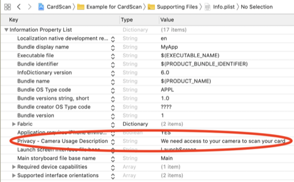

# iOS integration guide

## Requirements
* Objective C or Swift 4.0 or higher
* iOS 11.2 or higher \(supports development target of iOS 10.0 or higher\)
* iOS 13 or higher for our name and expiration models. The number model will work on older versions of iOS and it will
always return nil for the name and expiration fields.

## Installation
CardVerify is published to the bouncer private repositories. Please request access to this repository by emailing
[license@getbouncer.com](mailto:license@getbouncer.com) with a request for access.

CardVerify is available through [CocoaPods](https://cocoapods.org/). To install it, simply add the following line to
your Podfile:

```bash
pod 'CardVerify', :http => 'https://api.getbouncer.com/v1/downloads/sdk/card_verify/<your_api_key_here>/cardverify-ios-1.0.5031.tgz'
```

Next, install the new pod. From a terminal, run:

```bash
pod install
```

When using Cocoapods, you use the `.xcworkspace` instead of the `.xcodeproj`. Again from the terminal, run:

```bash
open YourProject.xcworkspace
```

## Set up permissions
CardScan uses the camera, so you'll need to add an description of camera usage to your Info.plist file:



The string you add here will be what CardScan displays to your users when CardScan first prompts them for permission to
use the camera.


Alternatively, you can add this permission directly to your Info.plist file:

```markup
<key>NSCameraUsageDescriptionkey>
<string>We need access to your camera to scan your cardstring>
```

## Configure CardVerify
CardVerify can be configured and run through Swift or Objective-C. CardVerify requires an API key, which can be
generated for your app through the [Bouncer API console](https://api.getbouncer.com/console). _Note that for CardVerify,
you will need permissions added to your API key to perform validation. Please contact
[support@getbouncer.com](mailto:support@getbouncer.com) once you've created your API key to have permissions added._

The CardScan SDK will send anonymous stats to Bouncer's servers.
[This code snippet](https://github.com/getbouncer/cardscan-ios/blob/da77e36c49f1de4b678e7ecaab56cc1466602716/CardScan/Classes/ScanStats.swift#L50)
shows what we send.

Apps using CardVerify must configure the library at launch.

### Swift
Configure the library when your application launches by adding CardScan to your `AppDelegate.swift` file. If you are
planning to use a navigation controller or support rotation, also be sure to add `supportedOrientationMaskOrDefault`.

```swift
import UIKit
import CardVerify

@UIApplicationMain
class AppDelegate: UIResponder, UIApplicationDelegate {

    func application(_ application: UIApplication, didFinishLaunchingWithOptions launchOptions: [UIApplicationLaunchOptionsKey: Any]?) -> Bool {
        Bouncer.configure(apiKey: "<your_api_key_here>")
        // do any other necessary launch configuration
        return true
    }
    
    func application(_ application: UIApplication, supportedInterfaceOrientationsFor window: UIWindow?) -> UIInterfaceOrientationMask {
        // if you are planning to embed scanViewController into a navigation controller, 
        // put this line to handle rotations
        return ScanBaseViewController.supportedOrientationMaskOrDefault()
    }
}
```

### Objective C
Configure the library when your application launches by adding CardScan to your `AppDelegate.m` file.

```objectivec
#import "AppDelegate.h"
@import CardVerify;

@implementation AppDelegate

- (BOOL)application:(UIApplication *)application didFinishLaunchingWithOptions:(NSDictionary *)launchOptions {
    // if you need to get an API key you can get one from here:
    // https://api.getbouncer.com/console
    [Bouncer configureWithApiKey:@"<your_api_key_here>"];
    return YES;
}

@end
```

## Using CardVerify
To use CardVerify, create a `VerifyCardSimpleViewController`, display it, and implement the `CardVerifySimpleResults`
protocol to receive results for the scan.

# Swift

```swift
import UIKit
import CardVerify

class ViewController: UIViewController, VerifyDelegate {
    override func viewDidLoad() {
        super.viewDidLoad()

        // Important! you need to make sure that CardVerify supports this hardware
        if !Bouncer.isCompatible() {
            // Deal with the case that this device isn't going to run CardVerify
        }
    }

    @IBAction func buttonPressed() {
        // Let the CardVerify library know some details about the current card that it can use to check for a match
        guard let vc = Bouncer.createVerifyViewController(
            last4: "4242",
            expiryMonth: "08",
            expiryYear: "22",
            network: PaymentCard.Network.VISA,
            withDelegate: self
        ) else {
            // the library won't create a VerifyCardSimpleViewController if this hardware isn't supported
            return
        }
        self.present(vc, animated: true, completion: nil)
    }

    // MARK: VerifyDelegate protocol
    func userCanceledScan(_ viewController: VerifyCardSimpleViewController) {
        // The user pressed on the back button without passing the challenge
        viewController.dismiss(animated: true, completion: nil)
    }

    func userDidScanCard(
        _ viewController: VerifyCardSimpleViewController,
        number: String,
        name: String?,
        expiryYear: String?,
        expiryMonth: String?,
        payload: String?
    ) {
        // The user scanned a card that has the last4 that matches the card on file
    
        // the encrypted payload is returned to client to pass back to server.
        // the payload can be exchanged with Bouncer server to verify it.
        guard let encryptedPayload = scannedCard.encryptedPayload else {
            return
        }
        MyAppsApi(parameter: [payload: encryptedPayload])
    }

    func userMissingCard(_ viewController: VerifyCardSimpleViewController) {
        // The user pressed the "I don't have this card" button
        viewController.dismiss(animated: true, completion: nil)
    }
}
```

# Objective C

```objectivec
#import "ViewController.h"
@import Stripe;

@interface ViewController ()

@end

@implementation ViewController

- (void)viewDidLoad {
    [super viewDidLoad];
    if (![VerifyCardSimpleViewController isCompatible]) {
         // Hide the "scan card" button because this device isn't compatible with CardScan       
    }
}

- (IBAction)scanCardPress:(id)sender {
    UIViewController *vc = [VerifyCardSimpleViewController createVerifyViewControllerWithLast4:self];
    [self presentViewController:vc animated:YES completion:nil];
}

- (void)userCanceledScanWithViewController:(VerifyCardSimpleViewController * _Nonnull)viewController  API_AVAILABLE(ios(11.2)){
    [self dismissViewControllerAnimated:YES completion:nil];
}

- (void)userCanceledScanWithViewController:(VerifyCardSimpleViewController * _Nonnull)viewController  API_AVAILABLE(ios(11.2)){
    [self dismissViewControllerAnimated:YES completion:nil];
}

- (void)userDidScanCardWithViewController:(VerifyCardSimpleViewController * _Nonnull)viewController number:(NSString * _Nonnull)number name:(NSString * _Nullable)name expiryYear:(NSString * _Nullable)expiryYear expiryMonth:(NSString * _Nullable)expiryMonth payload:(NSString * _Nullable)payload  API_AVAILABLE(ios(11.2)){
    // At this point you have the credit card number and optionally the expiry. You can either
    // tokenize the number or prompt the user for more information (e.g., CVV) before tokenizing.
    [self dismissViewControllerAnimated:YES completion:nil];
}

@end
```

## Customizing
This library is built to be customized to fit your UI. See the
[customization documentation](customizing-the-verify-ui-and-ux.md).

## Supporting more cards
Though CardScan supports several cards, you may need to add support for cards specific to your business, instructions
can be found in the [card support docs](card-support.md).

## Authors
[Sam King](mailto:sam@getbouncer.com), Jaime Park, Adam Wushensky

## License
A licensing agreement is required to use this library.

* Details of licensing \(pricing, etc\) are available at [https://cardscan.io/pricing](https://cardscan.io/pricing), or
you can contact us at [license@getbouncer.com](mailto:license@getbouncer.com).

All contributors must agree to the
[CLA](https://github.com/getbouncer/cardscan-android/blob/master/Contributor%20License%20Agreement).
