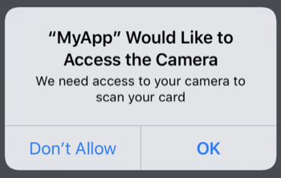

# iOS integration guide

## Requirements

* Objective C or Swift 4.0 or higher
* iOS 11 or higher \(supports development target of iOS 10.0 or higher\)

## Installation

As a first step, you must get access to our private repo for the CardVerify library. To get access [email Sam](mailto:sam@getbouncer.com), who's email address is [sam@getbouncer.com](mailto:sam@getbouncer.com).

CardVerify is available through [CocoaPods](https://cocoapods.org/). To install it, simply add the following line to your Podfile:

```bash
pod 'CardVerify', :http => 'https://api.getbouncer.com/v1/downloads/sdk/card_verify/<YOUR_API_KEY>/cardverify-ios-1.0.5025.tgz'
```

Next, install the new pod. From a terminal, run:

```bash
pod install
```

When using Cocoapods, you use the `.xcworkspace` instead of the `.xcodeproj`. Again from the terminal, run:

```bash
open YourProject.xcworkspace
```

## Permissions

Liveness Check uses the camera, so you'll need to add an description of camera usage to your Info.plist file:


The string you add here will be what Liveness Check displays to your users when Livenes Check first prompts them for permission to use the camera.



Alternatively, you can add this permission directly to your Info.plist file:

```markup
<key>NSCameraUsageDescriptionkey>
<string>We need access to your camera to scan your cardstring>
```

## Configure Liveness Check \(Swift\)

Configure the library when your application launches:

```swift
import UIKit
import CardVerify

@UIApplicationMain
class AppDelegate: UIResponder, UIApplicationDelegate {

    func application(_ application: UIApplication, didFinishLaunchingWithOptions launchOptions: [UIApplicationLaunchOptionsKey: Any]?) -> Bool {
         CardVerify.configure(apiKey: "YOUR API KEY") 
        // do any other necessary launch configuration
        return true
    }
}
```

## Using Liveness Check \(Swift\)

To use CardVerify, you create a `VerifyViewController`, display it, and implement the `VerifyDelegate` protocol to get the results.

```swift
import UIKit
import CardVerify

class ViewController: UIViewController, LivenessResults {

    @IBAction func buttonPressed() {
        let vc = LivenessViewController.createLivenessViewController()
        vc.livenessDelegate = self
          // cardOnFile is something that the app defines to keep
          // track of which card (bin and last four) the user
          // needs to verify
        vc.lastFour = cardOnFile?.last4
          vc.isFrontOfCard = true
          self.present(vc, animated: true)
    }

    // MARK: -LivenessResults protocol

    // Liveness check invokes this method after scanning a single
    // side successfully. The scan includes relevant card details,
    // if it was able to extract them, and a copy of an image of
    // the card.
    func userDidScanCard(viewController: LivenessViewController, number: String?, name: String?, expiryYear: String?, expiryMonth: String?, scannedImage: UIImage) {
        cardImageView.image = scannedImage
        guard let cardOnFile = cardOnFile else {
            print("no card on file")
            return
        }

          // IMPORTANT: after a successful scan, you need to invoke
          // the client-side fraud models using the `runVerifyPipeline`
          // method. This can take up to 1-2s, so make sure that you
          // mask the delay appropriately.
        viewController.runVerifyPipeline(cardToVerify: cardOnFile, number: number ?? "", expiryYear: expiryYear, expiryMonth: expiryMonth, debugForceError: nil) { [weak self] paymentCard in
            guard let self = self else { return }
            print("done with completion loop")
            self.dismiss(animated: true)
        }
    }

    // The user clicked on the `Cancel` button
    func userCanceledLiveness(viewController: LivenessViewController) {
        dismiss(animated: true)
    }
}
```

## Customizing the Liveness Check UI

We provide full UI and UX customization using two main mechanisms: subclassing and accessing UI variables. For full customization, you can subclass our `LivenessViewController`. We expose almost everything in this view controller and subclassing it should give you the ability to fully customize the look and feel. The `LivenessViewController` inherits from our `SimpleScanViewController`, see our [iOS customization guide](../card-scan/ios-integration-guide/ios-customization-guide.md) for more details on how to fully customize the UI. In addition to the UI elements that the `LivenessCheckViewController` inherits from `SimpleScanViewController`, it adds two UI effects that you can customize by overriding these two functions:

* `setRoiBorderOnCardDetected` sets the border of the ROI rectangle green when it detects a card \(either side\) in its view port
* `setupDescriptionTextUi` sets the description text depending on the last 4 that you pass in and the side of the card that you're expecting the user to scan.

The second method is to instantiate a version of the `LivenessViewController` and customize it by accessing it's variables directly. This implementation path is more straightforward but isn't as flexible as subclassing.

## Authors

Sam King, [sam@getbouncer.com](mailto:sam@getbouncer.com)

## License

CardVerify is proprietary software and only to be used by people who have a contract in place with Bouncer.

