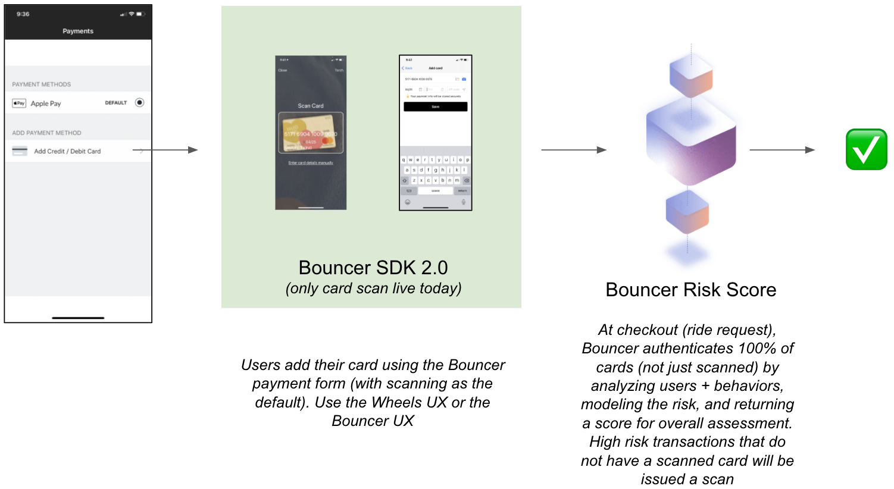

# Get started

In your app, where users add credit cards, replace your current "add a card" flow with Zero Fraud, and we'll authenticate the payment method while improving conversion, independent of how your users prefer to enter card details.

Our flow defaults to card scanning, similar to other cutting edge payments flows, but gives users the option to enter card details manually if they prefer. While all of this happens, we look for telltale signs of fraud.

At checkout, send a "card authentication payload" to Bouncer's servers and we'll give you a fraud score for that card and the ability to [forced-verify cards](../card-verify/get-started.md) if you detect anything suspicious.

