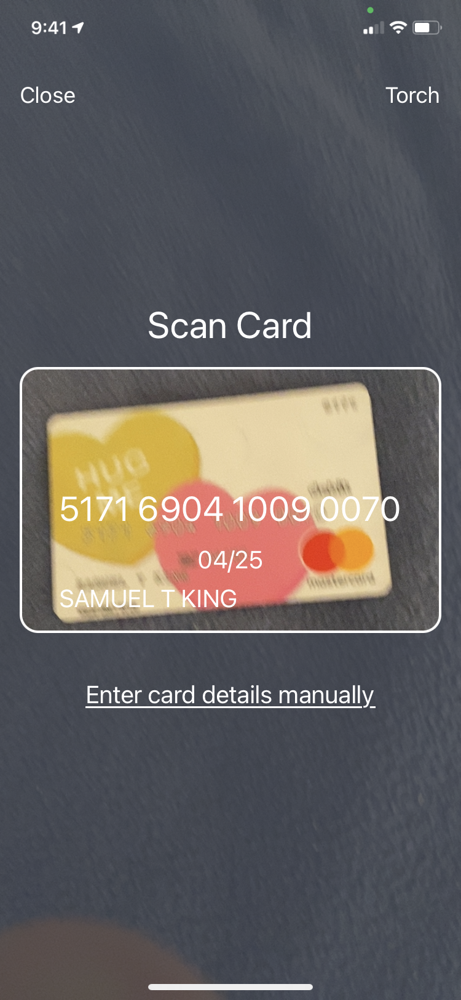
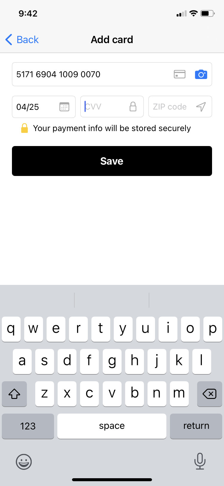

# Get started

In your app, where users add credit cards replace your current "add a card" flow with Zero Fraud, and we'll authenticate the payment method while striving to maximize conversion, independent of how your users prefer to enter card details.

Our flow defaults to card scanning, similar to other cutting edge payments flows, but gives users the option to enter card details manually if they prefer.

We pre-fill the scanned details and let the user fill in the rest, while continuing to look for telltale signs of fraud.

