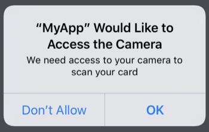

# iOS integration guide

## Requirements

* Objective C or Swift 4.0 or higher
* iOS 11.2 or higher \(supports development target of iOS 10.0 or higher\)
* iOS 13 or higher for our name and expiration models. The number model will

  work on older versions of iOS and it will always return nil for the name and

  expiration fields.

## iPad Support

CardScan defaults to a `formSheet` for the iPad, which handles all screen orientations and autorotation correctly. However, if you'd like to use CardScan in full screen mode instead, make sure to select the `Requires full screen` option in your `Info.plist` file via XCode, or else non-portrait orientations won't work.

## Installation

CardVerify is published to the bouncer private repositories. Please request access to this repository by emailing [license@getbouncer.com](mailto:license@getbouncer.com) with a request for access.

CardVerify is available through [CocoaPods](https://cocoapods.org/). To install it, simply add the following line to your Podfile:

```bash
pod 'CardVerify', :http => 'https://api.getbouncer.com/v1/downloads/sdk/card_verify/<your_api_key_here>/cardverify-ios-1.0.5038.tgz'
```

Next, install the new pod. From a terminal, run:

```bash
pod install
```

When using Cocoapods, you use the `.xcworkspace` instead of the `.xcodeproj`. Again from the terminal, run:

```bash
open YourProject.xcworkspace
```

## Set up permissions

CardScan uses the camera, so you'll need to add an description of camera usage to your Info.plist file:


The string you add here will be what CardScan displays to your users when CardScan first prompts them for permission to use the camera.



Alternatively, you can add this permission directly to your Info.plist file:

```markup
<key>NSCameraUsageDescriptionkey>
<string>We need access to your camera to scan your cardstring>
```

## Configure CardVerify

CardVerify can be configured and run through Swift or Objective-C. CardVerify requires an API key, which can be generated for your app through the [Bouncer API console](https://api.getbouncer.com/console). _Note that for CardVerify, you will need permissions added to your API key to perform validation. Please contact_ [_support@getbouncer.com_](mailto:support@getbouncer.com) _once you've created your API key to have permissions added._

The CardScan SDK will send anonymous stats to Bouncer's servers. [This code snippet](https://github.com/getbouncer/cardscan-ios/blob/da77e36c49f1de4b678e7ecaab56cc1466602716/CardScan/Classes/ScanStats.swift#L50) shows what we send.

Apps using CardVerify must configure the library at launch.



Configure the library when your application launches by adding CardScan to your `AppDelegate.swift` file. If you are planning to use a navigation controller or support rotation, also be sure to add `supportedOrientationMaskOrDefault`.

```swift
import UIKit
import CardVerify

@UIApplicationMain
class AppDelegate: UIResponder, UIApplicationDelegate {

    func application(
        _ application: UIApplication,
        didFinishLaunchingWithOptions launchOptions: [UIApplicationLaunchOptionsKey: Any]?
    ) -> Bool {
        Bouncer.configure(apiKey: "<your_api_key_here>")
        // do any other necessary launch configuration
        return true
    }

    func application(
        _ application: UIApplication,
        supportedInterfaceOrientationsFor window: UIWindow?
    ) -> UIInterfaceOrientationMask {
        // if you are planning to embed scanViewController into a navigation
        // controller, put this line to handle rotations
        return ScanBaseViewController.supportedOrientationMaskOrDefault()
    }
}
```



Configure the library when your application launches by adding CardScan to your `AppDelegate.m` file.

```objectivec
#import "AppDelegate.h"
@import CardVerify;

@implementation AppDelegate

- (BOOL)application:(UIApplication *)application didFinishLaunchingWithOptions:(NSDictionary *)launchOptions {
    // if you need to get an API key you can get one from here:
    // https://api.getbouncer.com/console
    [Bouncer configureWithApiKey:@"<your_api_key_here>"];
    return YES;
}

@end
```



## 

